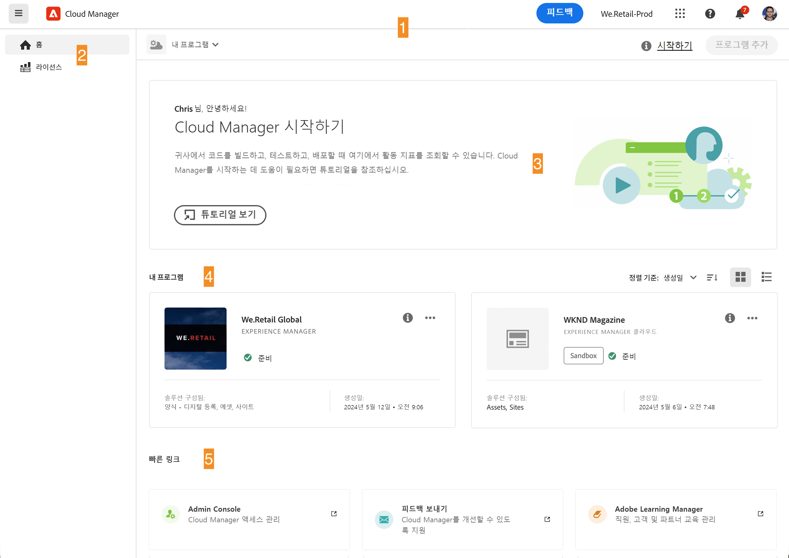
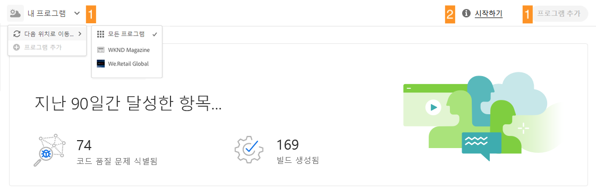
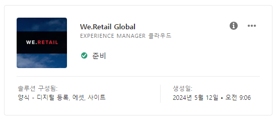
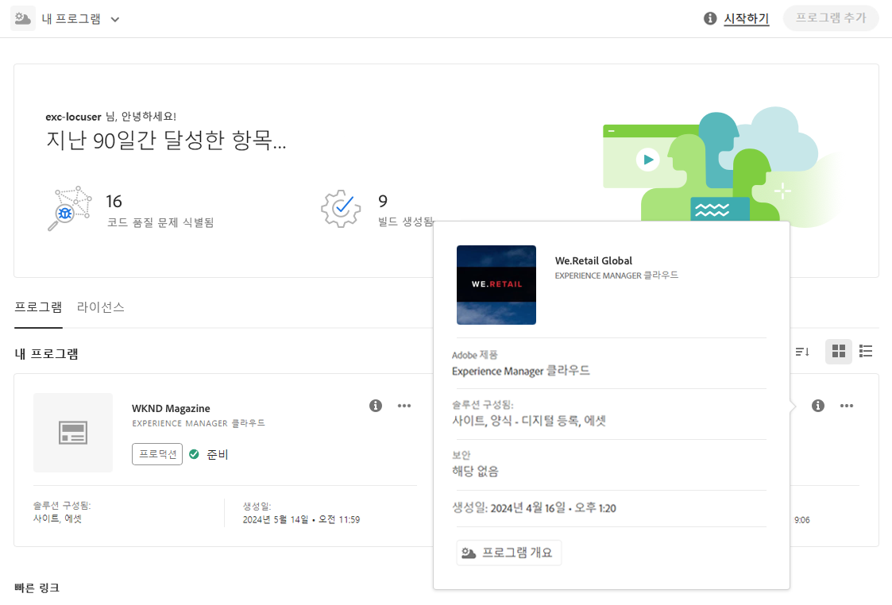
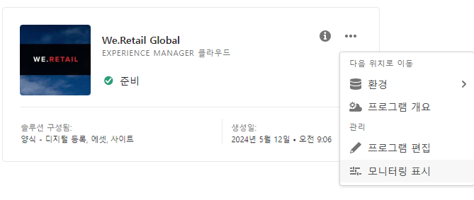
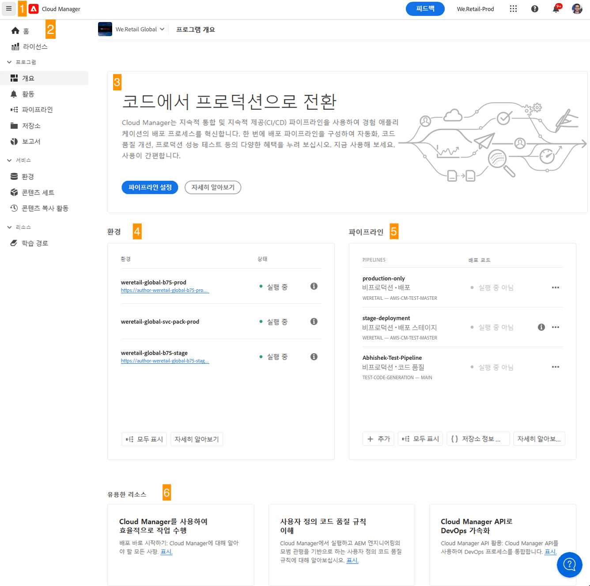
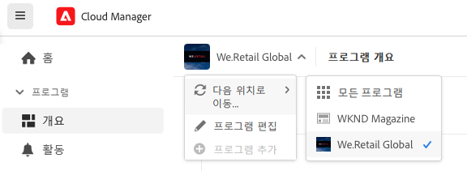
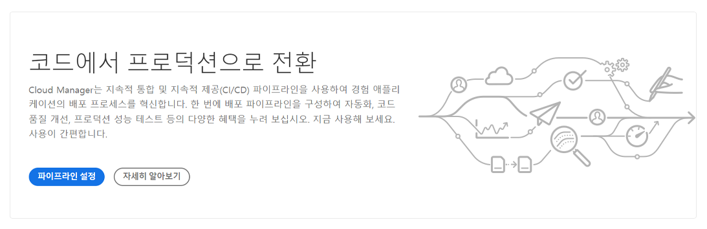

# Cloud Manager UI 탐색 {#navigation}

Cloud Manager UI가 구성되는 방식과 프로그램 및 환경을 관리하기 위해 탐색하는 방법을 알아봅니다.

Cloud Manager UI는 주로 두 가지 그래픽 인터페이스로 구성됩니다.

* [내 프로그램 콘솔](#my-programs-console)에서는 모든 프로그램을 조회하고 관리할 수 있습니다.
* [프로그램 개요 창](#program-overview)에서는 개별 프로그램의 세부 정보를 확인하고 관리할 수 있습니다.

## 내 프로그램 콘솔 {#my-programs-console}

[my.cloudmanager.adobe.com](https://my.cloudmanager.adobe.com/)에서 Cloud Manager에 로그인하고 적절한 조직을 선택하면 **내 프로그램** 콘솔이 표시됩니다.

내 프로그램 콘솔은 선택한 조직에서 액세스할 수 있는 모든 프로그램에 대한 개요를 제공합니다. 여러 부분으로 구성되어 있습니다.

1. [도구 모음](#toolbars-my-programs-toolbars) - 조직 선택, 알림 및 계정 설정
1. 프로그램의 현재 보기를 토글할 수 있는 탭입니다.
   * **홈** 보기(기본값) - 모든 프로그램의 개요가 포함된 **내 프로그램** 보기 선택
   * **라이선스** - 라이선스 대시보드에 액세스 라이선스 대시보드는 AMS 프로그램이 아닌 AEM as a Cloud Service에만 적용됩니다.
      * 프로그램에 있는 서비스 유형(AMS 또는 AEMaaCS)을 확인하려면 이 문서의 [프로그램 카드 섹션](#program-cards)을 참조하십시오.
   * 탭은 기본적으로 닫히며 [Cloud Manager 헤더](#cloud-manager-header)의 햄버거 메뉴를 사용하여 표시할 수 있습니다.
1. [콜 투 액션 및 통계](#cta-statistics) - 최근 활동 개요
1. [**내 프로그램** 섹션](#my-programs-section) - 사용자의 모든 프로그램에 대한 개요 포함
1. [빠른 링크](#quick-links) - 관련 리소스에 쉽게 액세스

>[!TIP]
>
>프로그램에 대한 자세한 내용은 [프로그램 및 프로그램 유형](/help/getting-started/program-setup.md)을 참조하세요.

### 도구 모음 {#my-programs-toolbars}

두 개의 도구 모음이 서로 겹쳐져 있습니다.

#### Cloud Manager 헤더 {#cloud-manager-header}

첫 번째는 Cloud Manager를 탐색할 때 유지되는 Cloud Manager 헤더입니다. 이는 Cloud Manager 프로그램 전체에 적용되는 설정 및 정보에 대한 액세스를 제공하는 앵커입니다.

1. 햄버거 메뉴를 통해 개별 프로그램의 특정 부분으로 이동하거나 컨텍스트에 따라 라이선스 대시보드와 **[내 프로그램](#my-programs-console)** 콘솔 간을 전환할 수 있는 탭에 액세스할 수 있습니다.
   * 라이선스 대시보드는 AMS 프로그램이 아닌 AEM as a Cloud Service에만 적용됩니다.
   * 프로그램에 있는 서비스 유형(AMS 또는 AEMaaCS)을 확인하려면 이 문서의 [프로그램 카드 섹션](#program-cards)을 참조하십시오.
1. Cloud Manager 버튼을 사용하면 Cloud Manager의 어느 위치에 있든 Cloud Manager의 내 프로그램 콘솔로 돌아갑니다.
1. Cloud Manager Adobe에 대한 피드백을 제공하려면 피드백 버튼을 클릭합니다.
1. 조직 선택기는 현재 로그인되어 있는 조직(이 예에서는 Foundation Internal)을 표시합니다. Adobe ID이 여러 조직과 연결되어 있는 경우 을 클릭하여 다른 조직으로 전환합니다.
1. 솔루션 전환기를 클릭하면 다른 Experience Cloud 솔루션으로 빠르게 이동할 수 있습니다.
1. 도움말 아이콘은 학습 및 지원 리소스에 대한 바로 가기를 제공합니다.
1. 알림 아이콘에 현재 할당된 미완료 [알림](/help/using/notifications.md) 수가 배지로 지정되어 있습니다.
1. 사용자를 나타내는 아이콘을 선택하여 사용자 설정에 액세스합니다. 사용자 사진을 구성하지 않은 경우, 아이콘이 임의로 할당됩니다.

#### 프로그램 도구 모음 {#program-toolbar}

프로그램 도구 모음은 Cloud Manager 프로그램과 상황에 적합한 작업 간을 전환할 수 있는 링크를 제공합니다.

1. 프로그램 선택기는 다른 프로그램을 빠르게 선택하거나 새 프로그램 만들기와 같이 상황에 맞는 작업을 수행할 수 있는 드롭다운을 엽니다.
1. 시작하기 링크를 통해 [온보딩 설명서 여정](https://experienceleague.adobe.com/ko/docs/experience-manager-cloud-service/content/onboarding/journey/overview)에 액세스하여 Cloud Manager를 시작하고 실행할 수 있습니다.
   * 온보딩 여정은 Cloud Service for AMS가 아닌 AEM as a Cloud Service용으로 설계되었지만 개념은 대부분 동일합니다.
1. 작업 버튼으로 새 프로그램 만들기와 같이 상황에 맞는 작업을 수행할 수 있습니다.

### 콜 투 액션 및 통계 {#cta-statistics}

콜 투 액션 및 통계 섹션은 조직에 대한 집계 데이터를 제공합니다. 예를 들어 프로그램을 성공적으로 설정했다면 다음을 포함하여 지난 90일 동안의 활동 통계가 표시될 수 있습니다.

* [배포](/help/using/code-deployment.md) 수
* 식별된 [코드 품질 문제](/help/using/code-quality-testing.md) 수
* 빌드 수

또는 조직 설정을 이제 막 시작하는 경우 다음 단계 또는 설명서 리소스에 대한 팁이 있을 수 있습니다.

### 내 프로그램 섹션 {#my-programs-section}

내 프로그램 콘솔의 주요 내용은 **내 프로그램** 섹션으로, 여기에 프로그램이 개별 카드로 나열됩니다. 프로그램에 대한 자세한 내용을 보려면 카드를 클릭하여 프로그램의 **프로그램 개요** 페이지에 액세스합니다.

>[!NOTE]
>
>권한에 따라서는 특정 프로그램을 선택하지 못할 수도 있습니다.

정렬 옵션을 사용하여 필요한 프로그램을 더 효과적으로 찾을 수 있습니다.

* 정렬 기준
   * 만든 날짜(기본값)
   * 프로그램 이름
   * 상태
* 오름차순(기본값)/내림차순
* 그리드 보기(기본값)
* 목록 보기

#### 프로그램 카드 {#program-cards}

모든 프로그램은 카드(또는 표의 행)로 표시되어 프로그램 개요, 그리고 조치를 취할 수 있는 빠른 링크를 제공합니다.

* 프로그램 이미지(구성된 경우)
* 프로그램 이름
* 서비스 유형:
   * AMS 프로그램용 **Experience Manager**
   * [AEM as a Cloud Service 프로그램](https://experienceleague.adobe.com/ko/docs/experience-manager-cloud-service/content/implementing/home)용 **Experience Manager Cloud**
* 상태
* 구성된 솔루션
* 생성일

정보 아이콘을 사용하면 프로그램에 대한 추가 정보에 빠르게 액세스할 수 있습니다(목록 보기에서 유용함).

줄임표 아이콘을 사용하면 프로그램에서 수행할 수 있는 추가 작업에 액세스할 수 있습니다.

* 프로그램의 특정 [환경](/help/using/managing-environments.md)으로 이동
* [프로그램 개요](#program-overview) 열기
* [프로그램 편집](/help/getting-started/program-setup.md)
* 모니터링 표시

### 빠른 링크 {#quick-links}

빠른 링크 섹션을 통해 일반적으로 사용되는 관련 리소스에 액세스할 수 있습니다.

## 프로그램 개요 창 {#program-overview}

[**내 프로그램** 콘솔](#my-programs-console)에서 프로그램을 선택하면 프로그램 개요로 이동합니다.

프로그램 개요를 통해 Cloud Manager 프로그램의 모든 세부 정보에 액세스할 수 있습니다. 내 프로그램 콘솔과 마찬가지로 여러 부분으로 구성되어 있습니다.

1. [도구 모음](#program-overview-toolbar): 내 프로그램 콘솔로 빠르게 돌아가서 프로그램을 탐색합니다.
1. [탭](#program-tabs) - 프로그램의 다양한 측면 간 전환
1. [콜 투 액션](#cta) - 프로그램의 마지막 작업에 기반
1. [환경 개요](#environments) - 프로그램의 환경 개요
1. [파이프라인 개요](#pipelines) - 프로그램의 파이프라인 개요
1. [유용한 리소스](#useful-resources) - 유용한 리소스 링크

### 도구 모음 {#program-overview-toolbar}

프로그램 개요의 도구 모음은 [내 프로그램 콘솔](#my-programs-toolbars)의 도구 모음과 매우 유사합니다. 차이점만 여기에 나와 있습니다.

#### Cloud Manager 헤더 {#cloud-manager-header-2}

Cloud Manager 헤더에는 프로그램 개요의 탐색 가능한 탭을 표시하기 위해 자동으로 열리는 햄버거 메뉴가 있습니다.

햄버거 메뉴 아이콘을 클릭하여 탭을 숨깁니다.

#### 프로그램 도구 모음 {#program-toolbar-2}

프로그램 도구 모음을 사용하면 다른 프로그램으로 빠르게 전환할 수 있을 뿐만 아니라 프로그램 추가 및 편집과 같이 상황에 맞는 작업에 액세스할 수도 있습니다.

또한 햄버거 메뉴를 사용하여 탭을 숨긴 경우 도구 모음은 항상 현재 있는 탭을 표시합니다.

### 프로그램 탭 {#program-tabs}

각 프로그램에는 이와 관련된 많은 옵션과 데이터가 있습니다. 이러한 데이터는 탭으로 모여 있어 프로그램을 탐색하기가 더 쉽습니다. 탭을 통해 다음 항목에 액세스할 수 있습니다.

* 개요 - 현재 문서에 설명된 프로그램 개요
* [활동](/help/using/managing-pipelines.md#activity) - 프로그램의 파이프라인 실행 기록
* [파이프라인](/help/using/managing-pipelines.md#pipelines) - 프로그램에 대해 구성된 모든 파이프라인
* [저장소](/help/managing-code/managing-repositories.md) - 프로그램에 대해 구성된 모든 저장소
* [보고서](/help/using/monitoring-environments.md#system-monitoring-overview) - SLA 데이터 등의 지표
* [환경](/help/using/managing-environments.md) - 프로그램에 대해 구성된 모든 환경
* [콘텐츠 세트](/help/using/content-copy.md) - 복사 목적으로 만들어진 콘텐츠 세트
* [콘텐츠 복사 활동](/help/using/content-copy.md) - 콘텐츠 복사 활동
* 학습 경로 - Cloud Manager의 추가 학습 리소스

기본적으로 프로그램을 열면 **개요** 탭이 표시됩니다. 현재 탭이 강조 표시됩니다. 세부 정보를 보려면 다른 탭을 선택합니다.

탭을 숨기려면 [Cloud Manager 헤더](#cloud-manager-header-2)의 햄버거 메뉴를 사용합니다.

### 콜 투 액션 {#cta}

콜 투 액션 섹션에서는 프로그램 상태에 따라 유용한 정보를 제공합니다. 새 프로그램의 경우 제공되는 다음 단계 및 Go-Live 날짜 알림 메시지를 볼 수 있습니다. [프로그램 생성 중 설정](/help/getting-started/program-setup.md).

라이브 상태인 프로그램의 경우, 세부 정보 및 새 배포 시작 링크가 포함된 마지막 배포 상태입니다.

### 환경 카드 {#environments}

**환경** 카드를 통해 환경 개요 및 빠른 작업에 대한 링크를 확인할 수 있습니다.

**환경** 카드에는 세 가지 환경만 나열됩니다. 프로그램의 모든 환경을 보려면 **모두 표시**&#x200B;를 클릭합니다.

환경 관리 방법에 대한 자세한 내용은 [환경 관리](/help/using/managing-environments.md)를 참조하십시오.

### 파이프라인 카드 {#pipelines}

**파이프라인** 카드는 빠른 작업에 대한 파이프라인 및 링크에 대한 개요를 제공합니다.

**파이프라인** 카드에는 세 가지 파이프라인만 나열됩니다. 프로그램의 모든 파이프라인을 보려면 **모두 표시**&#x200B;를 클릭합니다.

파이프라인 관리 방법에 대한 자세한 내용은 [파이프라인 관리](/help/using/managing-pipelines.md)를 참조하십시오.

### 유용한 리소스 {#useful-resources}

**유용한 리소스** 섹션에서는 Cloud Manager의 추가 학습 리소스에 대한 링크를 제공합니다.
