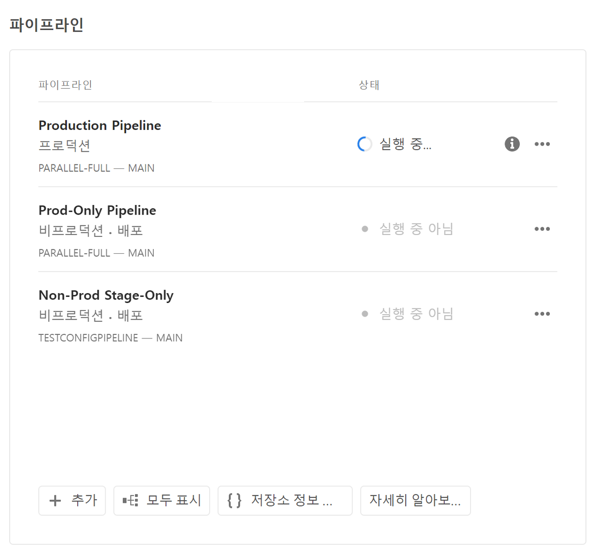
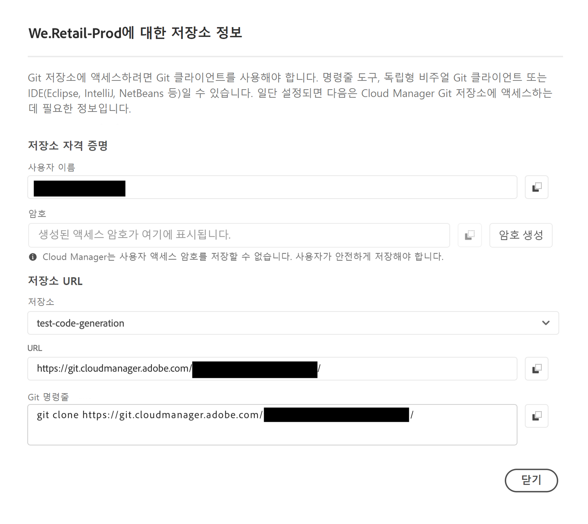
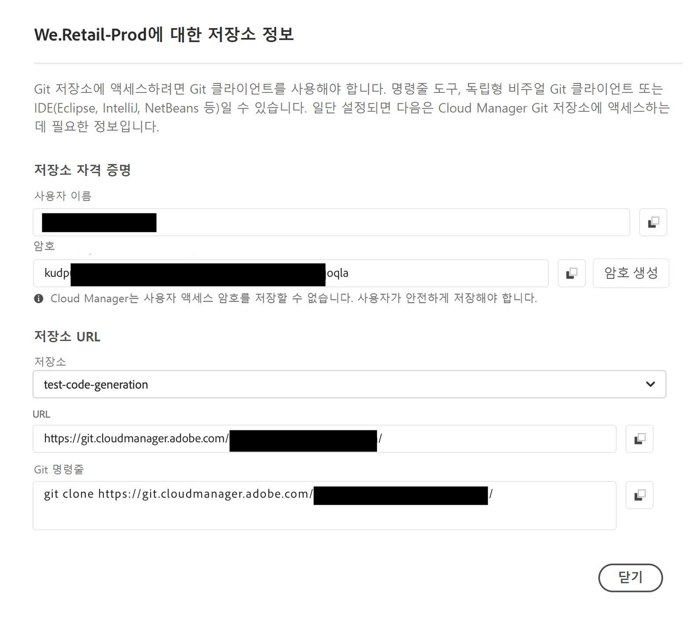

# 저장소 액세스 정보 {#accessing-repos}

Cloud Manager에서 셀프서비스 Git 계정 관리를 사용하여 Adobe 관리 Git 저장소에 액세스하고 관리하는 방법을 알아봅니다.

## 개요 페이지에서 저장소 정보에 액세스 {#overview-page}

1. [my.cloudmanager.adobe.com](https://my.cloudmanager.adobe.com/)에서 Cloud Manager에 로그인한 다음 적절한 조직과 프로그램을 선택합니다.

1. **프로그램 개요** 페이지에서 **파이프라인** 카드로 이동합니다.

   

1. **저장소 정보 액세스**&#x200B;를 클릭합니다. **다음에 대한 저장소 정보...** 대화 상자에서 다음을 볼 수 있습니다.

   * Git 사용자 이름.
   * Git 암호입니다.
   * Cloud Manager Git 저장소의 URL.
   * Git 저장소에 원격으로 빠르게 추가하고 코드를 푸시하도록 Git 명령을 사전 빌드했습니다.

   

1. 암호에 액세스하려면 새로운 암호를 생성해야 합니다. **`Generate password`**&#x200B;를 클릭합니다.

1. **계속하시겠습니까...** 대화 상자에서 **암호 생성**&#x200B;을 클릭하여 암호 생성을 확인합니다.

   

1. **암호** 필드에 암호가 생성됩니다. 복사 아이콘을 클릭하여 클립보드에 복사합니다.

   * 암호를 생성하면 이전 암호가 무효화됩니다.
   * Cloud Manager은 액세스 암호를 저장하지 않습니다. 이 암호를 안전하게 저장하십시오.
   * 암호를 잊어버린 경우 새 암호를 생성해야 합니다.

   

이러한 자격 증명을 사용하여 저장소의 로컬 복사본을 복제하고 해당 로컬 저장소를 변경할 수 있으며 준비가 되면 Cloud Manager의 원격 코드 저장소에 코드 변경 사항을 다시 커밋할 수 있습니다.

>[!NOTE]
>
>* **저장소 정보 액세스** 옵션은 **개발자** 역할, **배포 관리자** 역할 또는 둘 다 있는 사용자에게 표시됩니다.
>* **저장소 정보 액세스** 버튼은 Adobe 관리 저장소에 대한 저장소 액세스 정보만 표시합니다. [비공개 저장소](private-repositories.md)에 대한 액세스 정보는 Cloud Manager에서 사용할 수 없습니다.

## 저장소 창에서 저장소 정보에 액세스 {#repositories-window}

**저장소 정보 액세스** 단추는 [**저장소** 창](managing-repositories.md)의 도구 모음에서도 사용할 수 있습니다. Adobe 관리 저장소에 액세스하는 것과 동일한 정보를 표시합니다.

## 액세스 암호 취소 {#revoke-password}

언제든지 액세스 암호를 취소할 수 있습니다. [이러한 요청에 대한 지원 티켓을 만듭니다](https://experienceleague.adobe.com/?support-solution=Experience+Manager&amp;support-tab=home#support).

이 티켓은 우선 순위가 높은 것으로 처리되며 일반적으로 하루 이내에 취소됩니다.
