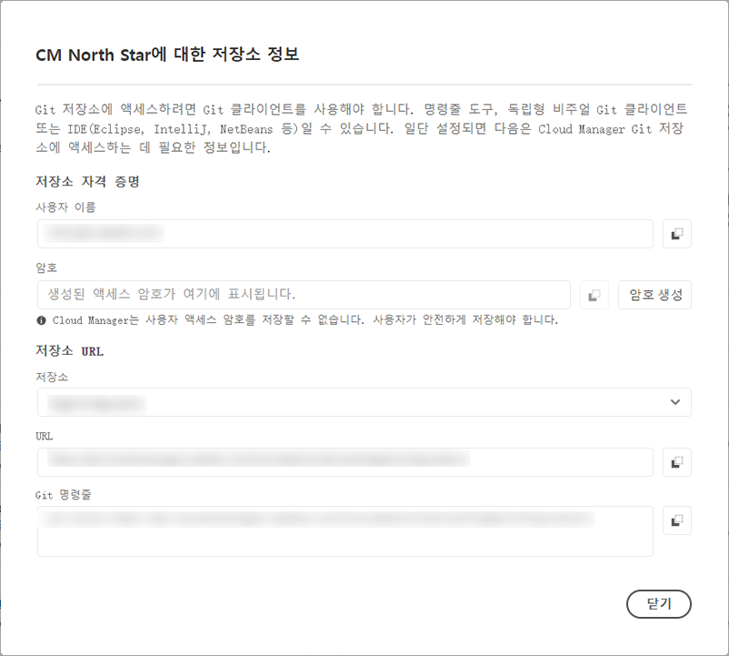

# 저장소 액세스 정보 {#accessing-repos}

Cloud Manager의 셀프서비스 Git 계정 관리를 사용하여 Adobe 관리 Git 저장소에 액세스하고 관리하는 방법을 알아봅니다.

## 개요 페이지에서 저장소 정보 액세스 {#overview-page}

Cloud Manager을 사용하면 **파이프라인** 카드에서 **저장소 정보 액세스**&#x200B;를 사용하여 Adobe 관리 저장소에 대한 저장소 액세스 정보를 검색할 수 있습니다.

**저장소 정보** 대화 상자를 사용하면 Adobe 관리 저장소에 대한 다음 액세스 정보를 볼 수 있습니다.

* Git 사용자 이름
* Git 암호
* Cloud Manager Git 저장소의 URL
* Git 저장소에 원격으로 추가하고 코드를 푸시하도록 Git 명령을 사전 빌드했습니다.

  

[비공개 저장소](/help/managing-code/private-repositories.md)에 대한 액세스 정보는 Cloud Manager에서 사용할 수 없습니다.

**저장소 정보 액세스** 기능은 **개발자** 또는 **배포 관리자** 역할이 있는 사용자에게 표시됩니다.

**개요 페이지에서 저장소 정보에 액세스하려면 다음 작업을 수행하십시오.**

1. [my.cloudmanager.adobe.com](https://my.cloudmanager.adobe.com/)에서 Cloud Manager에 로그인한 다음 적절한 조직과 프로그램을 선택합니다.

1. **파이프라인** 카드 아래의 **프로그램 개요** 페이지에서 **저장소 정보 액세스**&#x200B;를 클릭합니다.

   

1. 암호에 액세스하려면 새 암호를 생성해야 합니다. **저장소 정보** 대화 상자에서 **암호 생성**&#x200B;을 선택합니다.

1. 확인 대화 상자에서 **암호 생성**&#x200B;을 선택합니다.

1. **암호** 필드 오른쪽에 있는 을 클릭하여 암호를 클립보드에 복사합니다.

   * 암호를 생성하면 이전 암호가 무효화됩니다.
   * Cloud Manager는 암호를 저장하지 않습니다. 암호를 안전하게 저장하는 것은 사용자의 책임입니다.
   * Cloud Manager은 암호를 저장하지 않으므로 암호를 분실하면 새 암호를 생성해야 합니다.

   

이러한 자격 증명을 사용하여 저장소의 로컬 복사본을 복제하고, 해당 로컬 저장소를 변경하고, 준비가 되면 Cloud Manager의 원격 코드 저장소에 코드 변경 사항을 다시 제출할 수 있습니다.

## 저장소 창에서 저장소 정보 액세스 {#repositories-window}

[**저장소** 페이지](/help/managing-code/managing-repositories.md)에서도 **저장소 정보 액세스** 기능을 사용할 수 있습니다. Adobe 관리 저장소 액세스에 대한 정보와 동일한 내용이 표시됩니다.

## 액세스 암호 취소 {#revoke-password}

언제든지 액세스 암호를 취소할 수 있습니다.

암호를 취소하려면 [이 요청에 대한 지원 티켓을 만드십시오](https://experienceleague.adobe.com/ko?support-solution=Experience+Manager&support-tab=home#support). 티켓은 우선 순위가 높게 지정되며 일반적으로 하루 이내에 해결됩니다.
