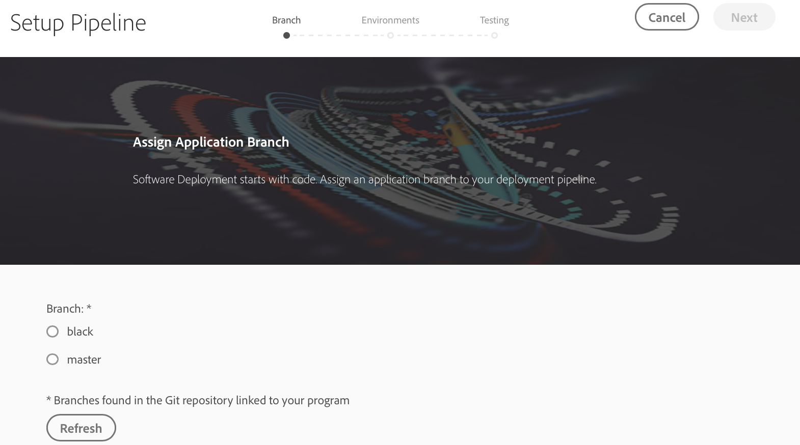
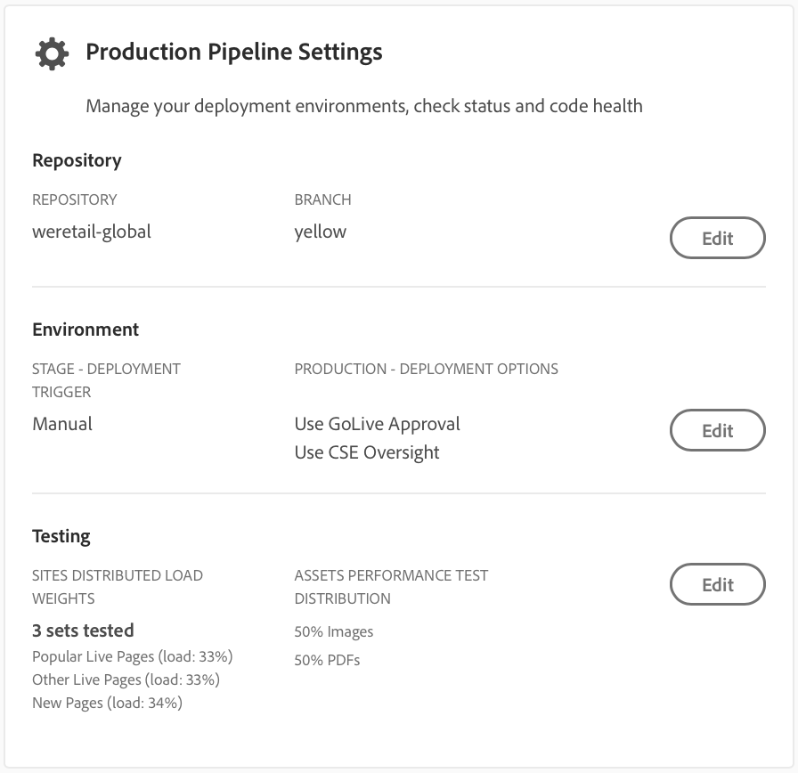
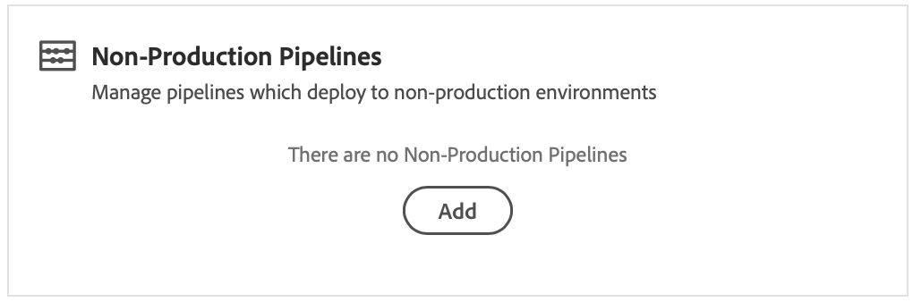

# CI/CD 파이프라인 구성 {#configure-your-ci-cd-pipeline}

다음 페이지에서는 파이프라인을 구성하는 방법을 **설명합니다**. 파이프라인의 작동 방식에 대한 자세한 개념 정보를 살펴보려면 CI/CD [파이프라인 개요를](ci-cd-pipeline.md)참조하십시오.

## 비디오 자습서 {#video-tutorial-one}

### Cloud Manager에서 파이프라인 구성 {#config-pipeline-video}

CI/CD 프로덕션 파이프라인 구성은 프로덕션 배포 및 성능 테스트 매개 변수를 제어하는 매개 변수, 파이프라인을 시작하는 트리거를 정의합니다.

>[!VIDEO](https://video.tv.adobe.com/v/26314/?captions=kor)

## 흐름 이해 {#understanding-the-flow}

UI의 파이프라인 설정 **타일에서** 파이프라인을 구성할 수 [!UICONTROL Cloud Manager] 있습니다.

배포 관리자는 파이프라인을 설정할 책임이 있습니다. 이렇게 하면 먼저 Git 리포지토리에서 분기를 **선택합니다**. 파이프라인 구성은 다음과 같이 구성됩니다.

* 파이프라인을 시작할 트리거를 정의합니다.
* 프로덕션 배포를 제어하는 매개 변수 정의
* 성능 테스트 매개 변수 구성을 참조하십시오.

## 파이프라인 설정 {#setting-up-the-pipeline}

>[!CAUTION]
>
>Git 리포지토리에 하나 이상의 분기가 있고 프로그램 설정이 [완료될 때까지 파이프라인을 설정할 수](setting-up-program.md) 없습니다.

코드를 배포하기 전에 에서 파이프라인 설정을 구성해야 합니다 [!UICONTROL Cloud Manager].

>[!NOTE]
>
>초기 설정 후 파이프라인 설정을 변경할 수 있습니다.

### 파이프라인 설정 구성 [!UICONTROL Cloud Manager]{#configuring-the-pipeline-settings-from-cloud-manager}

UI를 사용하여 프로그램을 설정하면 [!UICONTROL Cloud Manager] 파이프라인을 설정할 수 있습니다.

다음 단계에 따라 파이프라인에 대한 비헤이비어와 기본 설정을 구성합니다.

1. 파이프라인 **설정** (Setup Pipeline)을 클릭하여 파이프라인을 설정하고 구성합니다.

   

1. 파이프라인 **설정** 화면이 표시됩니다.

   3단계 마법사를 사용하여 분기, 환경 **및 테스트**&#x200B;환경을 **설정할**&#x200B;수 **있습니다** .
Git 분기를 선택하고 [다음]을 **클릭합니다**.

   >[!NOTE]
   >
   >Git 리포지토리에 있는 분기는 프로그램에 연결됩니다.

   

1. 환경 **탭에** 액세스하여 스테이지 및 프로덕션 **옵션을** **** 선택할 수있습니다.

   트리거를 정의하여 파이프라인을 시작할 수 있습니다.

   * **Git 변경** 시 - 구성된 git 분기에 커밋이 추가될 때마다 CI/CD 파이프라인을 시작합니다. 이 옵션을 선택하더라도 항상 수동으로 파이프라인을 시작할 수 있습니다.
   * **수동** - UI를 사용하여 파이프라인을 수동으로 시작합니다.
   * **예약됨** - 이 옵션은 향후 릴리스에서 곧 제공될 예정입니다.
   파이프라인 설정 또는 편집 중에 배포 관리자는 코드 품질, 보안 테스트 및 성능 테스트와 같은 품질 게이트에서 중요한 오류가 발생하는 경우 파이프라인의 동작을 정의할 수 있습니다.

   이 기능은 보다 자동화된 프로세스를 원하는 고객에게 유용합니다. 사용 가능한 옵션은 다음과 같습니다.

* **항상** 묻기 - 이 설정은 기본 설정이며 중요 오류에 대해 수동으로 개입해야 합니다.
* **즉시** 실패 - 이 옵션을 선택하면 중요 오류가 발생할 때마다 파이프라인이 취소됩니다. 이는 기본적으로 사용자가 각 실패를 수동으로 거부하는 경우를 에뮬레이션합니다.
* **즉시** 계속 - 이 옵션을 선택하면 중요 오류가 발생할 때마다 파이프라인이 자동으로 진행됩니다. 이는 기본적으로 사용자가 각 실패를 수동으로 승인하는 것입니다.

   이제 프로덕션 배포를 제어하는 매개 변수를 정의합니다. 사용 가능한 세 가지 옵션은 다음과 같습니다.

* **실시간 승인** 사용 - 배포는 UI를 통해 비즈니스 소유자, 프로젝트 관리자 또는 배포 관리자가 수동으로 승인해야 [!UICONTROL Cloud Manager] 합니다.
* **CSE 감독** 사용 - CSE가 실제로 배포를 시작하기 위해 개입합니다. CSE 감독을 활성화한 상태에서 파이프라인 설정 또는 편집하는 동안 배포 관리자는 다음을 선택할 수 있습니다.

   * **모든 CSE**:사용 가능한 모든 CSE를 참조함
   * **내 CSE**:cse가 사무실 밖에 있는 경우 고객에게 할당된 특정 CSE를 나타냅니다.

* **예약됨** - 이 옵션을 사용하면 예약된 프로덕션 배포를 활성화할 수 있습니다.

>[!NOTE]
>
>예약 **옵션을** 선택한 경우 단계 배포 **후** 파이프라인으로 프로덕션 배포를 예약하고, 일정이 설정된 경우 **GoLive 승인**&#x200B;사용을 선택하여일정을 설정할 때까지 기다릴 수 있습니다. 사용자는 프로덕션 배포를 즉시 실행하도록 선택할 수도 있습니다.
>
>배포 일정을 [**설정하거나 즉시**](deploying-code.md)프로덕션을 실행하려면 코드 배포를 참조하십시오.

>[!NOTE]
>
>모든 **고객은 CSE 감독** 사용 옵션을 사용할 수 없습니다.

**단계 배포 후 승인**

프로덕션 파이프라인에서 구성할 **수 있는 단계 배포 후** 승인(선택 사항)이 있습니다.
이 옵션은 파이프라인 편집(Pipeline Edit) **화면의 새 옵션에서 사용할 수** 있습니다.

그러면 파이프라인 실행 중에 별도의 단계로 표시됩니다.

>[!NOTE]
>
>**단계 배포 후** 승인하면 제작 배포 전 승인과 유사하게 작동하지만, 단계 배포 단계 바로 직후에 모든 테스트가 완료되고 나면 수행되는 프로덕션 배포 전 승인과 비교하여 테스트가 완료되기 바로 그 결과가 발생합니다.

**발송자 무효화**

배포 관리자는 파이프라인을 설정 또는 편집하는 동안 AEM Dispatcher 캐시에서 **무효화되거나** 플러시되는 **** 경로 세트를 구성할 수 있습니다.

스테이지 및 프로덕션 배포에 대해 별도의 경로 세트를 구성할 수 있습니다. 구성된 경우 컨텐츠 패키지가 배포된 바로 후에 이러한 캐시 작업이 배포 파이프라인 단계의 일부로 수행됩니다. 이러한 설정은 표준 AEM Dispatcher 비헤이비어를 사용합니다. 무효화는 작성자에서 게시로 컨텐츠를 활성화한 경우와 유사하게 캐시 무효화를 수행합니다.flush는 캐시 삭제를 수행합니다.

일반적으로 무효화 작업을 사용하는 것이 좋지만 특히 AEM HTML 클라이언트 라이브러리를 사용할 때 플러시가 필요한 경우도 있습니다.

>[!NOTE]
>
>Dispatcher [캐싱에 대한](dispatcher-configurations.md) 자세한 내용은 Dispatcher 개요를 참조하십시오.

Dispatcher Invalidate를 구성하려면 아래 절차를 따르십시오.

1. Dispatcher **구성** 제목 아래에서 구성을 클릭합니다.

   

1. 경로를 입력하고 유형에서 작업을 선택한 **다음**&#x200B;추가를 **클릭합니다**. 환경당 최대 100개의 경로를 지정할 수 있습니다. 패스를 추가한 후 적용을 **클릭합니다**.

   

1. 파이프라인 설정(Pipeline Settings) **페이지로 돌아가면** 업데이트된 선택 사항 요약이 표시됩니다.

   저장을 **클릭하여** 이 구성을 유지합니다.

   

1. 테스트 **탭에** 액세스하여 프로그램의 테스트 기준을 정의합니다.

   이제 성능 테스트 매개 변수를 구성할 수 있습니다.

   라이선스가 부여된 *제품에* 따라 AEM Sites 및 *AEM Assets* Performance Testing을 구성할 수 있습니다.

   **AEM Sites:**

   Cloud Manager는 스테이지 게시 서버에서 30분 동안(인증되지 않은 사용자로) 페이지를 요청하고 각 페이지에 대한 응답 시간과 다양한 시스템 수준 지표를 측정하여 AEM Sites 프로그램에 대한 성능 테스트를 실행합니다.페이지는 세 **페이지 세트로**&#x200B;선택됩니다.세트 1~3개 중 원하는 세트를 선택할 수 있습니다. 트래픽의 분배는 선택된 집합 수를 기반으로 합니다. 즉, 세 개 모두를 선택한 경우 전체 페이지 보기 중 33%가 각 집합에 배치됩니다.두 개를 선택하면 50%가 각 세트로 이동합니다.하나를 선택하면 트래픽의 100%가 해당 세트로 이동합니다.

   예를 들어, 인기 있는 라이브 페이지와 새 페이지 세트(이 예에서는 다른 라이브 페이지가 사용되지 않음) 사이에 50%/50%가 분할되었고 새 페이지 세트에 3000페이지가 포함되어 있다고 가정해 보겠습니다. 분당 페이지 뷰 수 KPI는 200으로 설정됩니다. 30분 이상의 테스트 기간:

   * 인기 있는 라이브 페이지 세트의 25개 페이지 각각은 240회 히트 - (200 * 0.5) / 25) * 30 = 120

   * 새 페이지 세트의 3000개 각 페이지가 한 번 히트(200 * 0.5) / 3000) * 30 = 1
   

   **AEM Assets:**

   Cloud Manager는 30분 테스트 기간 동안 자산을 반복적으로 업로드하고 각 자산에 대한 처리 시간과 다양한 시스템 수준 지표를 측정하여 AEM Assets 프로그램에 대한 성능 테스트를 실행합니다. 이 기능은 이미지와 PDF 문서를 모두 업로드할 수 있습니다. 분당 업로드되는 각 유형의 자산 수의 분배는 파이프라인 설정 또는 편집 화면에서 설정됩니다.

   예를 들어, 아래 그림과 같이 70/30 분할이 사용된 경우 분당 10개의 에셋이 업로드되고 분당 7개의 이미지가 업로드되며 3개의 문서가 업로드됩니다.

   

   >[!NOTE]
   >
   >기본 이미지와 PDF 문서가 있지만 대부분의 경우 고객은 자신의 에셋을 업로드해야 합니다. 이 작업은 파이프라인 설정 또는 편집 화면에서 수행할 수 있습니다. JPEG, PNG, GIF 및 BMP와 같은 일반적인 이미지 형식은 Photoshop, Illustrator 및 Postscript 파일과 함께 지원됩니다.

1. 저장을 **클릭하여** 파이프라인 프로세스 설정을 완료합니다.

   >[!NOTE]
   >
   >또한 파이프라인을 설정했으면 UI의 프로덕션 파이프라인 설정 **타일을 사용하여 동일한** 설정을 편집할 수 [!UICONTROL Cloud Manager] 있습니다.

   

## 비프로덕션 및 코드 품질 전용 파이프라인

스테이지와 프로덕션에 배포되는 기본 파이프라인 외에도 고객은 비프로덕션 파이프라인이라고 하는 추가 파이프라인을 설정할 **수 있습니다**. 이러한 파이프라인은 항상 빌드 및 코드 품질 단계를 실행합니다. 선택적으로 Adobe Managed Services 환경에 배포할 수도 있습니다.

## 비프로덕션 및 코드 품질 전용 파이프라인에 대한 비디오

## 비디오 자습서 {#video-tutorial-two}

### Cloud Manager 비프로덕션 및 코드 품질 전용 파이프라인 {#non-prod-video}

CI/CD 비프로덕션 파이프라인은 코드 품질 파이프라인 및 배포 파이프라인의 두 가지 카테고리로 분류됩니다. 코드 품질은 Git 분기의 모든 코드를 분석하여 Cloud Manager의 코드 품질 스캔을 기반으로 구축 및 평가됩니다.

>[!VIDEO](https://video.tv.adobe.com/v/26316/?captions=kor)

홈 화면에서 이러한 파이프라인은 새로운 카드에 나열됩니다.

1. Cloud **Manager** 홈 화면에서 비프로덕션 파이프라인 타일에 액세스합니다.

   

1. 추가 버튼을 클릭하여 파이프라인 이름, 파이프라인 유형 및 Git 분기를 지정합니다.

   또한 파이프라인 옵션에서 배포 트리거 및 중요 실패 동작을 설정할 수도 있습니다.

   

1. 저장을 **클릭하면** 파이프라인이 홈 화면의 카드에 다음과 같은 세 가지 작업이 표시됩니다.

   * **편집** - 파이프라인 설정을 편집할 수 있습니다.
   * **세부 사항** - 마지막 파이프라인 실행을 표시합니다(있을 경우).
   * **빌드** - 파이프라인을 실행할 수 있는 실행 페이지로 이동합니다.
   

   >[!NOTE]
   >
   >파이프라인이 실행되는 동안 현재 단계가 표시되고 세부 정보 **작업만** 사용할 수 있습니다.

## 다음 단계 {#the-next-steps}

파이프라인을 구성한 후에는 코드를 배포해야 합니다.

자세한 내용은 [코드](deploying-code.md) 배포를 참조하십시오.
