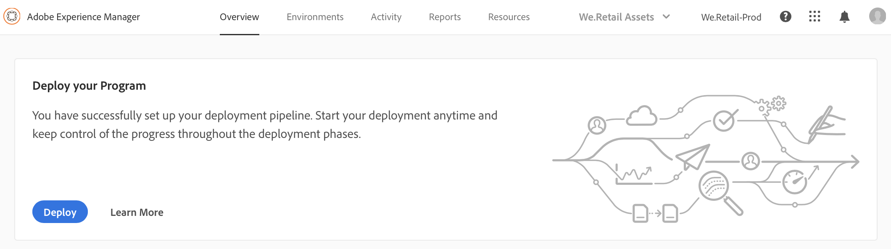
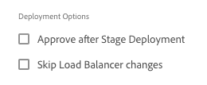

# 코드 배포 {#deploy-your-code}

## Cloud Manager를 사용하여 코드 배포 {#deploying-code-with-cloud-manager}

>[!NOTE]
>AEM as a Cloud Service에서 Cloud Manager용 코드 배포에 대한 자세한 내용은 다음을 참조하십시오 [여기](https://experienceleague.adobe.com/docs/experience-manager-cloud-service/implementing/using-cloud-manager/deploy-code.html?lang=en#using-cloud-manager).

프로덕션 파이프라인(저장소, 환경 및 테스트 환경)을 구성했으면 코드를 배포할 준비가 된 것입니다.

1. 클릭 **배포** 클라우드 관리자에서 배포 프로세스를 시작합니다.

   

1. 다음 **파이프라인 실행** 화면이 표시됩니다.

   클릭 **빌드** 프로세스를 시작합니다.

   

1. 전체 빌드 프로세스에서 코드를 배포합니다.

   다음 단계는 빌드 프로세스에 관련되어 있습니다.

   1. 스테이지 배포
   1. 단계 테스트
   1. 프로덕션 배포

   >[!NOTE]
   >
   >또한 테스트 기준에 대한 로그를 보거나 결과를 검토하여 다양한 배포 프로세스의 단계를 검토할 수 있습니다.

   The **Stage Deployment**, involves the following steps:

   * 유효성 검사: 이 단계에서는 파이프라인이 현재 사용 가능한 리소스(예: 구성된 분기가 존재하며 환경을 사용할 수 있도록 구성됩니다.
   * 빌드 및 단위 테스트: 이 단계에서는 컨테이너화된 빌드 프로세스를 실행합니다. 자세한 내용은 [빌드 환경 이해](/help/using/build-environment-details.md) 빌드 환경에 대한 자세한 내용을 참조하십시오.
   * 코드 스캔: 이 단계에서는 애플리케이션 코드의 품질을 평가합니다. 자세한 내용은 [테스트 결과 이해](understand-your-test-results.md) 를 참조하십시오.
   * 스테이지에 배포

   

   다음 **단계 테스트**&#x200B;에는 다음 단계가 포함됩니다.

   * 보안 테스트: 이 단계는 AEM 환경에 애플리케이션 코드가 미치는 보안 영향을 평가합니다. 자세한 내용은 [테스트 결과 이해](understand-your-test-results.md) 를 참조하십시오.
   * 성능 테스트: 이 단계에서는 애플리케이션 코드의 성능을 평가합니다. 자세한 내용은 [테스트 결과 이해](understand-your-test-results.md) 를 참조하십시오.

   

   다음 **프로덕션 배포**&#x200B;에는 다음 단계가 포함됩니다.

   * **승인 신청** (활성화된 경우)
   * **프로덕션 배포 예약** (활성화된 경우)
   * **CSE 지원** (활성화된 경우)
   * **프로덕션에 배포**

   

   >[!NOTE]
   >
   >다음 **프로덕션 배포 예약** 이 활성화되어 있을 뿐만 아니라 파이프라인을 구성할 수 있습니다.
   >
   >
   >이 옵션을 사용하여 프로덕션 배포를 예약하거나 **지금** 프로덕션 배포를 즉시 실행하려면
   >
   >
   >예약된 날짜와 시간은 사용자의 시간대에 따라 지정됩니다.
   >
   >
   >클릭 **확인** 설정을 확인하려면

   

   배포 일정을 확인하면 코드 배포가 완료됩니다.

   다음 화면이 표시될 때 **지금** 위의 단계에서 옵션이 선택됩니다.

   

## 시간 초과 {#timeouts}

사용자 피드백을 기다리고 있는 경우 다음 단계가 시간 초과됩니다.

| 단계 | 시간 초과 |
|--- |--- |
| 코드 품질 테스트 | 14일 |
| 보안 테스트 | 14일 |
| 성능 테스트 | 14일 |
| 승인 신청 | 14일 |
| 프로덕션 배포 예약 | 14일 |
| CSE 지원 | 14일 |

## 배포 프로세스 {#deployment-process}

다음 섹션에서는 AEM 및 Dispatcher 패키지가 단계 및 프로덕션 단계에서 배포되는 방법을 설명합니다.

Cloud Manager는 빌드 프로세스에서 생성된 모든 target/*.zip 파일을 저장 위치에 업로드합니다.  이러한 가공물은 파이프라인의 배포 단계 동안 이 위치에서 검색됩니다.

Cloud Manager가 비프로덕션 토폴로지에 배포될 때 목표는 가능한 한 빨리 배포를 완료하여 아티팩트가 다음과 같이 모든 노드에 동시에 배포되는 것입니다.

1. Cloud Manager는 각 아티팩트가 AEM 패키지인지 또는 디스패처 패키지인지를 결정합니다.
1. Cloud Manager는 배포 중에 환경을 격리하기 위해 로드 밸런서에서 모든 디스패처를 제거합니다.

   별도로 구성되지 않은 경우 스테이지 환경에서 비프로덕션 파이프라인, 개발 환경 및 프로덕션 파이프라인의 로드 밸런서 변경 사항 즉, 단계를 분리하고 연결할 수 있습니다.

   

   >[!NOTE]
   >
   >이 기능은 주로 1-1-1 고객이 사용할 것입니다.

1. 각 AEM 아티팩트는 패키지 관리자 API를 통해 각 AEM 인스턴스에 배포되며 패키지 종속성이 배포 순서를 결정합니다.

   패키지를 사용하여 새 기능을 설치하고 인스턴스 간에 컨텐츠를 전송하며 저장소 컨텐츠를 백업하는 방법에 대한 자세한 내용은 패키지 사용 방법 을 참조하십시오.

   >[!NOTE]
   >
   >모든 AEM 가공물은 작성자와 게시자 모두에 배포됩니다. 실행 모드는 노드별 구성이 필요할 때 활용해야 합니다. 실행 모드에서 특정 목적으로 AEM 인스턴스를 튜닝할 수 있는 방법에 대한 자세한 내용은 실행 모드 를 참조하십시오.

1. 디스패처 아티팩트는 다음과 같이 각 디스패처에 배포됩니다.

   1. 현재 구성이 백업되어 임시 위치에 복사됩니다.
   1. 변경할 수 없는 파일을 제외하고 모든 구성이 삭제됩니다. 자세한 내용은 Dispatcher 구성 관리 를 참조하십시오. 이렇게 하면 분리된 파일이 남아 있지 않도록 디렉토리를 지웁니다.
   1. 아티팩트가 `httpd` 디렉토리.  변경할 수 없는 파일은 덮어쓰지 않습니다. 배포 시 Git 리포지토리에서 변경할 수 없는 파일을 변경하면 변경 사항이 무시됩니다.  이러한 파일은 AMS 디스패처 프레임워크의 핵심이며 변경할 수 없습니다.
   1. Apache가 구성 테스트를 수행합니다. 오류가 없으면 서비스가 다시 로드됩니다. 오류가 발생하면 구성이 백업에서 복원되고 서비스가 다시 로드되며 오류가 Cloud Manager로 다시 보고됩니다.
   1. 파이프라인 구성에 지정된 각 경로는 디스패처 캐시에서 무효화되거나 플러시됩니다.

   >[!NOTE]
   >Cloud Manager에서는 디스패처 아티팩트에 전체 파일 세트가 포함되어야 합니다.  모든 Dispatcher 구성 파일은 Git 저장소에 있어야 합니다. 파일 또는 폴더가 누락되면 배포 오류가 발생합니다.

1. 모든 AEM 및 Dispatcher 패키지를 모든 노드에 성공적으로 배포한 후 Dispatcher가 로드 밸런서에 다시 추가되고 배포가 완료됩니다.

   >[!NOTE]
   >개발 및 스테이지 배포에서 로드 밸런서 변경을 건너뛸 수 있습니다. 즉, 스테이지 환경에서 비프로덕션 파이프라인, 개발자 환경 및 프로덕션 파이프라인에 대해 단계를 분리 및 연결할 수 있습니다.

### 프로덕션 단계에 배포 {#deployment-production-phase}

AEM 사이트 방문자에 대한 영향을 최소화하기 위해 프로덕션 토폴로지에 배포하는 프로세스는 약간 다릅니다.

프로덕션 배포는 일반적으로 위와 동일한 단계를 따르지만, 롤링 방식으로 수행합니다.

1. 작성자에게 AEM 패키지를 배포합니다.
1. 로드 밸런서에서 dispatcher1을 분리합니다.
1. AEM 패키지를 배포하여 publish1 및 dispatcher 패키지를 dispatcher1에 병렬로 플러시 디스패처 캐시를 만듭니다.
1. dispatcher1을 로드 밸런서에 다시 넣습니다.
1. dispatcher1이 다시 서비스를 제공되면 로드 밸런서에서 dispatcher2를 분리하십시오.
1. AEM 패키지를 배포하여 publish2 및 dispatcher 패키지를 dispatcher2에 동시에 플러시 디스패처 캐시를 배포합니다.
1. dispatcher2를 로드 밸런서에 다시 넣습니다.
이 프로세스는 배포가 토폴로지의 모든 게시자 및 디스패처에 도달할 때까지 계속됩니다.

## 긴급 파이프라인 실행 모드 {#emergency-pipeline}

중요한 상황에서 Adobe Managed Services 고객은 전체 Cloud Manager 테스트 주기가 실행될 때까지 기다리지 않고 단계 및 프로덕션 환경에 코드 변경 사항을 배포해야 할 수 있습니다.

이러한 상황을 해결하기 위해 Cloud Manager 프로덕션 파이프라인은 *비상* 모드. 이 모드를 사용하면 보안 및 성능 테스트 단계가 실행되지 않습니다. 구성된 승인 단계를 포함한 기타 모든 단계는 일반적인 파이프라인 실행 모드에서 실행됩니다.

>[!NOTE]
>긴급 파이프라인 실행 모드 기능은 고객 성공 엔지니어가 프로그램을 기반으로 활성화됩니다.

### 긴급 파이프라인 실행 모드 사용 {#using-emergency-pipeline}

프로덕션 파이프라인 실행을 시작할 때 이 기능이 활성화되면 아래 그림과 같이 대화 상자에서 일반 모드 또는 긴급 모드로 실행을 시작할 수 있습니다.


또한 응급 모드에서 실행되기 위한 파이프라인 실행 세부 사항 페이지를 볼 때 화면 상단의 탐색 표시는 이 특정 실행에 긴급 모드 가 사용되었음을 나타냅니다.


이 비상 모드에서 파이프라인 실행을 생성하는 것은 Cloud Manager API 또는 CLI를 통해 수행할 수도 있습니다. 응급 모드에서 실행을 시작하려면 쿼리 매개 변수를 사용하여 파이프라인의 실행 종단점에 PUT 요청을 제출하십시오 `?pipelineExecutionMode=EMERGENCY` 또는 CLI를 사용하는 경우

```
$ aio cloudmanager:pipeline:create-execution PIPELINE_ID --emergency
```

>[!IMPORTANT]
>사용 `--emergency` 플래그를 최신 버전으로 업데이트해야 할 수 있습니다. `aio-cli-plugin-cloudmanager` 버전.