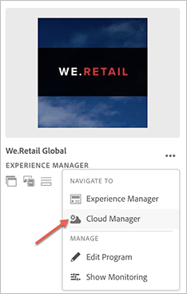

# 처음 로그인 {#first-time-login}

[!UICONTROL Cloud Manager]에 대한 일반 구성을 설정했으면 [!UICONTROL Cloud Manager]에 UI(사용자 인터페이스)를 사용할 준비가 되었습니다.

>[!NOTE]
>[!UICONTROL Cloud Manager]에 할당된 역할과 응용 프로그램의 상태에 따라 [!UICONTROL Cloud Manager] UI를 사용하는 동안 다른 화면이 표시됩니다.

## 처음으로 로그인 {#logging-in-for-the-first-time}

1. **Adobe[!UICONTROL Experience Cloud]**&#x200B;에 로그인하면 **프로그램** 목록이 표시됩니다.

1. 프로그램을 선택합니다(예: **We.Retail Global**). 랜딩 페이지에 프로그램 카드가 표시되면 **..** 사용 가능한 메뉴 옵션을 보려면 다음을 수행하십시오.   **Cloud Manager**&#x200B;를 선택하여 Cloud Manager의 **개요** 페이지로 이동합니다.

   

1. Cloud Manager의 **개요** 페이지가 표시됩니다.

   

1. **설정 프로그램**&#x200B;을 클릭하여 **프로그램** 설명을 설정하고 주요 성과 지표(KPI)를 정의합니다.

   >[!NOTE]
   >
   >다음 단계를 완료하려면 [프로그램 설정](https://helpx.adobe.com/experience-manager/cloud-manager/using/setting-up-program.html)을 참조하십시오.

## 비디오 자습서 {#video-tutorial-two}

### Cloud Manager 활동 탭 {#activity-video}

Cloud Manager는 프로그램의 활동에 대한 통합 보기를 제공하고, 모든 CI/CD 파이프라인 실행, 프로덕션 및 비프로덕션 모두를 나열하며, 과거 및 현재 활동을 표시할 수 있으며, 모든 활동의 세부 사항을 검토할 수 있습니다.

>[!VIDEO](https://video.tv.adobe.com/v/26313/)
