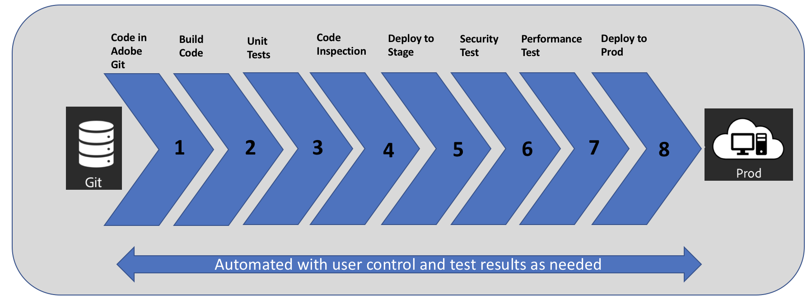

# 소개 [!UICONTROL Cloud Manager]{#introduction-to-cloud-manager}

## 소개 {#introduction}

[!UICONTROL Cloud Manager]Adobe Managed Cloud Services의 일부인 Adobe Experience Manager를 클라우드에서 직접 관리할 수 있습니다. IT 팀 및 구현 파트너가 성능 또는 보안을 손상시키지 않고 사용자 정의 또는 업데이트를 신속하게 전달할 수 있도록 CI/CD(Continuous Delivery) 프레임워크가 포함되어 있습니다.

조직은 [!UICONTROL Cloud Manager] 셀프 서비스 고객 포털을 사용하여 **다음 작업을** 수행/활용할 수 있습니다.

* **지속적인 통합/지속적인** 코드 전달을 통해 출시 시간을 월/주/일/시간으로 줄일 수 있습니다.
* **프로덕션 중단을 최소화하기 위해 프로덕션에 투입하기 전에 모범 사례를 기반으로 코드 검사, 성능 테스트 및 보안 유효성** 검사
* **업무 시간 외에서도 자동, 일정 또는 수동 배포를** 통해 유연성을 극대화하고 제어할 수 있습니다.
* **자동** 처리 기능을 통해 용량 증대에 대한 필요성을 지능적으로 감지하고 자동으로 추가 디스패처/게시 세그먼트를 만들 수 있습니다.

다음 이미지는 에서 사용되는 CI/CD 프로세스 흐름을 [!UICONTROL Cloud Manager]보여 줍니다.

## Key Features in [!UICONTROL Cloud Manager]{#key-features-in-cloud-manager}

조직은 다음과 같은 기능을 활용할 수 있습니다. [!UICONTROL Cloud Manager]:

### 셀프 서비스 인터페이스 {#self-service-interface}

고객이 Experience Manager 애플리케이션에 대한 클라우드 환경 및 CI/CD 파이프라인에 쉽게 액세스하고 관리할 수 [!UICONTROL Cloud Manager] 있도록 해주는 유저 인터페이스(UI)입니다.

고객은 애플리케이션별 KPI(Key Performance Indicator)를 정의할 수 있습니다. 이 KPI는 분당 최대 페이지 보기 횟수와 페이지 로드 예상 응답 시간을 제공하므로 성공적인 배포를 측정할 수 있습니다. 다양한 팀 구성원의 역할 및 권한을 손쉽게 정의할 수 있습니다. 새로운 셀프 서비스 인터페이스는 직접 제어할 수 있는 기능을 제공하지만 Adobe에서 모범 사례에 대한 링크를 제공하고 필요에 따라 필요한 지침을 제공할 수 있는 전문가와의 방문도 제공합니다.

UI를 살펴보고 시작하려면 [!UICONTROL Cloud Manager]첫 번째 로그인을 [참조하십시오](https://helpx.adobe.com/experience-manager/cloud-manager/using/first-time-login.html).

### CI/CD 파이프라인 {#ci-cd-pipeline}

주요 기능 중 [!UICONTROL Cloud Manager] 하나는 최적화된 CI/CD 파이프라인을 사용하여 사용자 정의 코드나 웹 사이트에 새 구성 요소를 추가하는 등의 업데이트를 신속하게 제공할 수 있다는 것입니다.

UI를 [!UICONTROL Cloud Manager] 통해 고객은 CI/CD 파이프라인을 구성하고 시작할 수 있습니다. 이 파이프라인이 진행되는 동안 고품질의 애플리케이션만 프로덕션 환경에 전달되도록 철저한 코드 검사가 실행됩니다.

UI에서 파이프라인 구성에 대한 자세한 내용은 CI/CD [!UICONTROL Cloud Manager]파이프라인 [구성을 참조하십시오](https://helpx.adobe.com/experience-manager/cloud-manager/using/configuring-pipeline.html).

### 유연한 배포 모드 {#flexible-deployment-modes}

[!UICONTROL Cloud Manager] 고객은 변화하는 비즈니스 요구에 따라 경험을 제공할 수 있도록 유연하고 구성 가능한 배포 모드를 제공합니다.

자동 트리거 모드에서는 코드가 코드 커밋과 같은 특정 이벤트를 기반으로 환경에 자동으로 배포됩니다. 지정된 기간 동안 업무 시간 외에서도 코드 배포를 예약할 수 있습니다.

배포 트리거에 관계없이 배포가 트리거될 때마다 품질 검사는 항상 CI/CD 파이프라인 실행의 일부로 수행됩니다. 품질 검사에는 고객이나 파트너의 노력 없이 즉시 제공되는 코드 검사, 보안 테스트 및 성능 테스트가 포함되어 있습니다.

코드 및 품질 검사 배포에 대한 자세한 내용은 코드 [배포를 참조하십시오.](deploying-code.md)

### 자동 처리 {#autoscaling}

[!UICONTROL Cloud Manager] 제작 환경이 비정상적으로 높은 로드의 영향을 받을 때 추가 용량이 필요함을 감지하고 자동 처리 기능을 통해 자동으로 추가 용량을 온라인으로 가져올 수 있습니다.

자동 처리 이벤트 중에 자동 처리 프로비저닝 프로세스가 [!UICONTROL Cloud Manager] 자동으로 트리거되고, 자동 처리 이벤트에 대한 알림을 보내고, 몇 분 내에 추가 용량을 온라인 상태로 만듭니다. 추가 용량은 운영 환경에서 동일한 지역에서 공급되며 실행 중인 발송자/게시 노드와 동일한 시스템 사양에 부합됩니다.

자동 처리 기능은 디스패처/게시 계층에만 적용되며, 항상 수평 크기 조절 방법을 사용하여 실행되며, 최소한 한 개의 디스패처/게시 쌍의 추가 세그먼트와 최대 10개의 세그먼트가 사용됩니다. 프로비저닝된 추가 용량은 CSE(Customer Success Engineer)에 의해 결정된 대로 10일 이내에 수동으로 조정됩니다.
