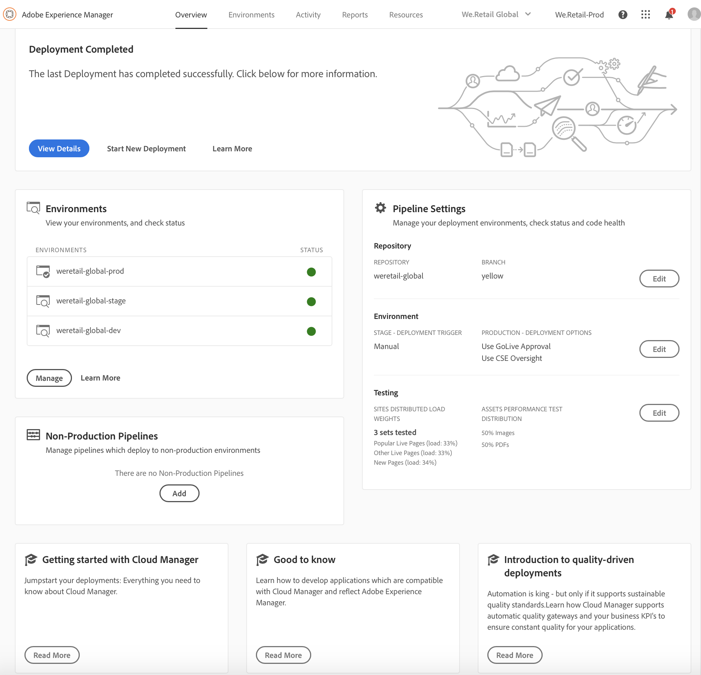
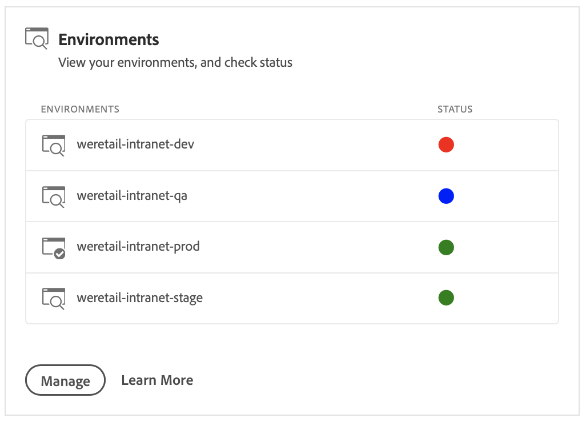

# 환경 관리 {#manage-your-environments}

Cloud **Manager의** 개요 페이지에는 **관리되는 모든 AEM** 환경을 나열하는 환경 타일이 포함되어 있습니다.

나열된 각 환경에는 연결된 상태가 표시됩니다.

## 비디오 자습서 {#video-tutorial}

### Cloud Manager 환경 개요 {#environ-video}

다음 비디오에서는 AEM 작성자, AEM 게시 및 발송자 인스턴스로 구성된 클라우드 관리자 환경에 대한 개요를 제공합니다.

>[!VIDEO](https://video.tv.adobe.com/v/26318/?captions=kor)

## Cloud Manager에서 환경 액세스 {#accessing-environments-in-cloud-manager}

환경 **타일에는** 프로그램에서 프로비저닝된 프로덕션 및 스테이지 환경이 상태와 함께 표시됩니다.

상태는 환경의 노드에 걸쳐 롤업된 전원 상태입니다. 모든 노드가 실행 중이면 녹색이고, 한 노드가 중지되더라도 빨간색은 빨간색이고, 한 노드라도 작동 중이면 파란색입니다. 이 우선 순위에 따라 한 노드가 사용 불가능한 전원 상태를 가지는 경우 노랑이 표시됩니다.

### 환경 {#environments}

관리를 **클릭하여** 환경 **화면을** 표시합니다.

환경 **화면에는** 제작 *및 스테이지* 환경 *(해당하는 경우)* 에 대한 카드가 표시됩니다. 각 카드 위에 환경 이름이 표시됩니다. 카드는 CPU, 스토리지, 영역 및 상태와 함께 환경의 노드 테이블을 포함합니다.

>[!NOTE]
>
>노드의 **STATUS는** VM의 전원 상태를 나타내며 서버의 AEM 상태를 반영하지 않습니다. 상태는 **실행(녹색 원), 중지됨** ( **빨간색 원** ), **위로** 올라오는 **파란색 원** (파란색 원) 또는사용할 수 없음(노란색 원)이 될 수 있습니다.

