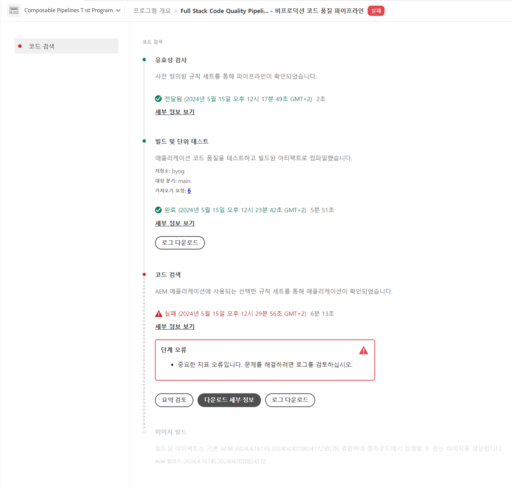

# 파이프라인 관리 {#managing-pipelines}

실행, 편집 및 삭제를 포함하여 기존 파이프라인을 관리하는 방법을 알아봅니다.

## 파이프라인 카드 {#pipeline-card}

Cloud Manager의 **프로그램 개요** 페이지에 있는 **파이프라인** 카드는 모든 파이프라인과 현재 상태에 대한 개요를 제공합니다.

각 파이프라인 옆에 있는 를 클릭하여 다음 작업을 수행할 수 있습니다.

* [파이프라인 실행](#running-pipelines).
* [파이프라인 편집](#editing-pipelines).
* [파이프라인 삭제](#deleting-pipelines).
* [세부 정보 보기](#view-details).

파이프라인 목록의 맨 아래에는 다음의 일반 옵션이 있습니다.

* **추가** - [새 프로덕션 파이프라인을 추가](/help/using/production-pipelines.md)하거나 [새 비프로덕션 파이프라인을 추가](/help/using/non-production-pipelines.md)합니다.
* **모두 표시** - **파이프라인** 화면으로 사용자를 이동하여 더 자세한 테이블에서 모든 파이프라인을 볼 수 있습니다.
* **저장소 액세스 정보** - Cloud Manager Git 저장소에 액세스하는 데 필요한 정보를 표시합니다.
* **자세히 알아보기** - CI/CD 파이프라인 설명서 리소스로 이동합니다.

## 파이프라인 페이지 {#pipelines}

**파이프라인** 페이지에는 선택한 프로그램에 대한 모든 파이프라인의 전체 목록이 표시됩니다. 이 목록은 [파이프라인 카드](#pipeline-card)에서 제공되는 정보보다 더 포괄적인 정보를 담고 있으므로 유용합니다.

1. [my.cloudmanager.adobe.com](https://my.cloudmanager.adobe.com/)에서 Cloud Manager에 로그인한 다음 적절한 조직과 프로그램을 선택합니다.

1. **프로그램 개요** 페이지에서 **파이프라인** 탭을 클릭하여 **파이프라인** 페이지로 전환합니다.

1. 여기서는 **파이프라인 카드**&#x200B;에서와 같이 프로그램의 모든 파이프라인 목록을 보고 파이프라인 실행을 시작 및 정지할 수도 있습니다.

`i` 아이콘을 클릭하면 파이프라인의 마지막 실행 또는 현재 실행에 대한 세부 정보가 표시됩니다.

**세부 정보 보기**&#x200B;를 클릭하면 [파이프라인 실행에 대한 세부 정보](#view-details)를 확인할 수 있습니다.

## 활동 페이지 {#activity}

**활동** 페이지에는 선택한 프로그램에 대한 모든 파이프라인 실행의 전체 목록이 표시됩니다.

1. [my.cloudmanager.adobe.com](https://my.cloudmanager.adobe.com/)에서 Cloud Manager에 로그인한 다음 적절한 조직과 프로그램을 선택합니다.

1. **프로그램 개요** 페이지에서 **활동** 탭을 클릭하여 **활동** 페이지로 전환합니다.

1. 여기에서는 현재 실행과 이전 실행을 포함하여 프로그램에 대한 모든 파이프라인 실행 목록을 볼 수 있습니다.

`i` 아이콘을 클릭하면 선택한 파이프라인 실행의 실행에 대한 세부 정보가 표시됩니다.

**세부 정보 보기**&#x200B;를 클릭해 [파이프라인 실행 세부 정보](#view-details)를 확인합니다.

## 파이프라인 실행 {#run-one-pipeline}

1. [my.cloudmanager.adobe.com](https://my.cloudmanager.adobe.com/)에서 Cloud Manager에 로그인한 다음 적절한 조직과 프로그램을 선택합니다.
1. **프로그램 개요** 페이지에서 **파이프라인** 카드로 이동합니다.
1. 실행하는 파이프라인 옆에 있는 를 클릭한 다음 **실행**&#x200B;을 클릭합니다.

   파이프라인 실행이 시작되면 상태 열에 표시됩니다.

   를 다시 클릭하고 **[세부 정보 보기](#view-details)**&#x200B;를 클릭하면 실행 세부 정보를 볼 수 있습니다.

   파이프라인 유형에 따라 를 다시 클릭하고 **취소**&#x200B;를 클릭하여 실행을 취소할 수 있습니다.

## 여러 파이프라인 실행 {#run-multiple-pipelines}

Cloud Manager을 사용하면 여러 파이프라인을 동시에 실행할 수 있으므로 Adobe Managed Services(AMS) 고객의 배포 효율성이 향상됩니다. **선택한 항목 실행** 기능을 사용하면 여러 파이프라인을 선택하고 한 번에 실행되도록 트리거할 수 있습니다. 파이프라인을 개별적으로 실행해야 하는 수작업 부담을 줄이고 빌드 및 배포 워크플로우를 최적화합니다.

**여러 파이프라인을 실행하려면:**

1. [my.cloudmanager.adobe.com](https://my.cloudmanager.adobe.com/)에서 Cloud Manager에 로그인한 다음 적절한 조직과 프로그램을 선택합니다.
1. 왼쪽 메뉴에서  **파이프라인**&#x200B;을 클릭합니다.
1. **파이프라인** 페이지의 표에서 실행할 파이프라인 옆에 있는 확인란을 선택합니다.
필요한 경우  **필터**&#x200B;를 클릭하여 이름, 환경, 배포된 코드 유형 또는 세 가지 모두를 조합하여 파이프라인을 정렬합니다.
1. 페이지의 오른쪽 상단 모서리에서 **선택한 항목 실행(x)**&#x200B;을 클릭합니다.
1. **선택한 파이프라인 실행(x)** 대화 상자에서 **실행(x)**&#x200B;을 클릭합니다.

   **실행** 단추는 진행할 수 있는 파이프라인 수를 반영합니다. 예를 들어 4개의 파이프라인을 선택했지만 하나는 이미 실행 중입니다. 또는 선택한 파이프라인에 연결된 환경이 더 이상 존재하지 않습니다. 이러한 경우 시스템이 그에 따라 조정됩니다. 버튼이 &quot;실행(3)&quot;으로 업데이트되어 세 개의 파이프라인이 진행될 수 있음을 나타냅니다.

1. 파이프라인이 실행되고 상태가 **파이프라인** 목록에서 업데이트됩니다.

## 파이프라인 편집 {#editing-pipelines}

실행 중인 파이프라인은 편집할 수 없습니다.

**파이프라인을 편집하려면:**

1. [my.cloudmanager.adobe.com](https://my.cloudmanager.adobe.com/)에서 Cloud Manager에 로그인한 다음 적절한 조직과 프로그램을 선택합니다.

1. **프로그램 개요** 페이지에서 **파이프라인** 카드로 이동합니다.

1. 편집할 파이프라인 옆에 있는 를 클릭한 다음 **편집**&#x200B;을 클릭합니다.

1. **프로덕션 파이프라인 편집** 또는 **비프로덕션 파이프라인 편집** 대화 상자에서 파이프라인 생성 중에 입력한 것과 동일한 세부 정보를 편집할 수 있습니다.

   파이프라인에 사용 가능한 필드 및 구성 옵션에 대한 자세한 내용은 [프로덕션 파이프라인 구성](/help/using/production-pipelines.md) 및 [비프로덕션 파이프라인 구성](/help/using/non-production-pipelines.md)을 참조하십시오.

1. 완료되면 **업데이트**&#x200B;를 클릭하세요.

## 파이프라인 삭제 {#deleting-pipelines}

실행 중인 파이프라인은 삭제할 수 없습니다.

**파이프라인을 삭제하려면:**

1. [my.cloudmanager.adobe.com](https://my.cloudmanager.adobe.com/)에서 Cloud Manager에 로그인한 다음 적절한 조직과 프로그램을 선택합니다.

1. **프로그램 개요** 페이지에서 **파이프라인** 카드로 이동합니다.

1. 실행하는 파이프라인 옆에 있는 를 클릭한 다음 **삭제**&#x200B;를 클릭합니다.

## 파이프라인 세부 정보 보기 {#view-details}

실행 중이거나 한 번 이상 실행된 파이프라인의 세부 정보만 볼 수 있습니다.

**파이프라인 세부 정보를 보려면:**

1. [my.cloudmanager.adobe.com](https://my.cloudmanager.adobe.com/)에서 Cloud Manager에 로그인한 다음 적절한 조직과 프로그램을 선택합니다.

1. **프로그램 개요** 페이지에서 **파이프라인** 카드로 이동합니다.

1. 실행하는 파이프라인 옆에 있는 를 클릭한 다음 **세부 정보 보기**&#x200B;를 클릭합니다.

1. 실행 중인 파이프라인의 세부 정보 페이지로 이동합니다.

여기에서 파이프라인의 다양한 단계 상태를 확인하고 진단 목적으로 빌드 로그를 검색할 수 있습니다. 자세한 내용은 [코드 배포](/help/using/code-deployment.md) 문서를 참조하십시오.

모든 파이프라인 실행 단계는 아직 시작되지 않은 단계가 회색으로 바뀌어 표시됩니다. 완료된 단계에는 기간이 표시됩니다.

파이프라인 단계가 완료되면 요약이 표시됩니다.

**기간** 섹션을 표시하려면 **세부 정보 보기** 링크를 클릭합니다. 이 섹션에는 해당 프로그램의 과거 트렌드를 기반으로 한 파이프라인의 평균 기간이 포함됩니다.

파이프라인에 문제가 발생한 **코드 스캔** 단계가 포함된 경우 **세부 정보 다운로드**&#x200B;를 클릭하여 통과하지 못한 [코드 품질 테스트](/help/using/code-quality-testing.md) 목록을 볼 수 있습니다.

**프로젝트 파일 위치** 열은 문제가 있는 코드의 위치를 &#x200B;&#x200B;나타내는 CSV 파일에서 사용할 수 있습니다. 이 열은 프로젝트 관련 경로이며, **파일 위치** 열은 Maven에서 생성됩니다.

