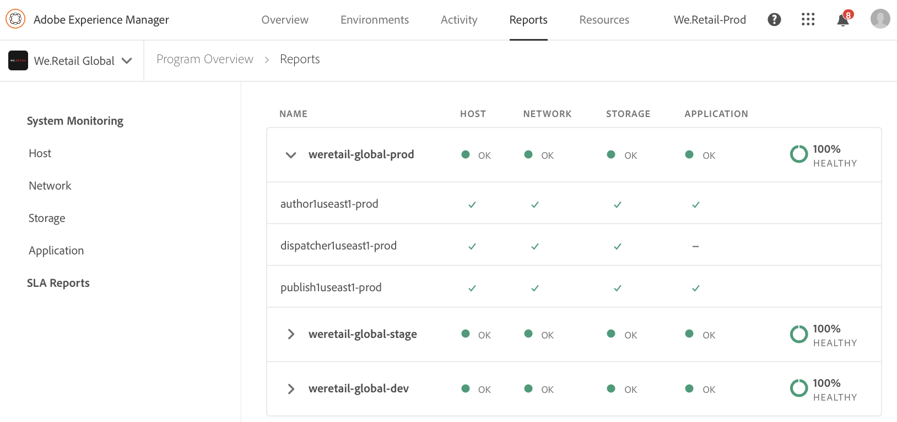
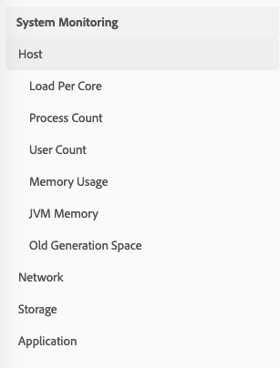

# 시스템 모니터링 {#system-monitoring}

[!UICONTROL Cloud Manager]의 시스템 모니터링은 환경 내의 개별 인스턴스를 관찰하고 각 인스턴스에 대한 다양한 지표를 추적하여 수행됩니다. 각 지표에는 *경고 임계값*&#x200B;과 *중요 임계값*&#x200B;이라는 두 개의 정의된 임계값이 있습니다.

지표가 중요한 임계값을 초과하는 경우 중요한 상태로 간주됩니다.지표가 경고 임계값을 초과하지만 위험 임계값 미만인 경우 경고 상태로 간주됩니다. 임계값은 Adobe Managed Services에서 설정되며 [!UICONTROL Cloud Manager]에서 시각화할 수 있습니다. 대부분의 경우 임계값은 고객 간에 일관되지만 Adobe Managed Services에서 특정 고객 요구 사항에 맞게 임계값을 수정하는 경우도 있습니다. 임계값에 대한 질문은 CSE(Customer Success Engineer)로 문의하십시오.

## 시스템 모니터링 {#navigating-system-monitoring} 탐색

시스템 모니터링 기능으로 이동하는 작업은 두 가지 방법으로 수행할 수 있습니다.

1. **Managed Services - 프로그램** 랜딩 페이지에 로그인합니다.

   

1. 프로그램 카드의 네 번째 아이콘을 클릭합니다.

   

   *또는*,

* [!UICONTROL Cloud Manager] 내의 **보고서** 전역 탐색 메뉴 항목을 통해 **시스템 모니터링** 랜딩 페이지로 이동합니다.

## 시스템 모니터링 개요 페이지 {#system-monitoring-overview-page}

[시스템 모니터링 개요] 페이지에는 프로그램의 모니터링된 환경과 4개의 개별 카테고리에 대한 상위 수준 상태에 대한 보고서가 표시됩니다.

* **호스트**
* **저장 용량**
* **네트워크**
* **애플리케이션**

각 카테고리의 상태는 개별 지표의 요약입니다. 카테고리의 지표가 위험 상태에 있는 경우 전체 카테고리는 개요 페이지의 목적에 있어 중요한 상태에 있습니다. 동일한 요약 내용을 환경 수준 및 인스턴스 수준에서 볼 수 있습니다.

>[!NOTE]
>
>이 페이지로 이동하면 기본적으로 프로덕션 환경 인스턴스가 표시되지만 다른 환경도 열 수 있습니다.

## 비디오 자습서 {#video-tutorial}

### 클라우드 관리자 보고서 개요 {#reports-video}

클라우드 관리자 보고서는 각 AEM 인스턴스에 대한 다양한 지표를 보고 추적하는 차트 세트를 통해 프로그램의 환경 및 AEM 인스턴스에 대한 보기를 제공합니다.
자세한 내용은 아래 비디오를 참조하십시오.

>[!VIDEO](https://video.tv.adobe.com/v/26315/)

## 시스템 모니터링 세부 정보 {#system-monitoring-detail}

특정 지표의 세부 사항을 보려면 왼쪽 탐색 영역에서 카테고리 중 하나를 클릭하거나 특정 인스턴스에 대한 카테고리 표시기 중 하나를 클릭합니다. 각 세부 사항 페이지에는 해당 카테고리 내의 지표에 대한 일련의 그래프가 표시됩니다. 환경 또는 특정 인스턴스에 대한 지표를 볼 수 있습니다. 오른쪽 상단 모서리의 드롭다운 상자를 사용하여 환경과 인스턴스 간을 전환할 수 있습니다.

왼쪽의 탐색은 현재 선택된 환경 및 인스턴스에 대한 데이터가 있는 현재 선택된 카테고리 내에서 사용 가능한 지표를 보여줍니다.

개별 그래프는 임계값과 함께 시간에 따른 데이터의 상태 및 그래프를 표시합니다. 여러 인스턴스가 표시되면 각 인스턴스의 데이터가 별도의 시리즈에 있게 됩니다.

개별 시리즈는 범례에서 시리즈를 클릭하여 그래프에 숨길 수 있습니다.
예를 들어 경고 임계값 시리즈를 클릭하면 위험 임계값만 표시됩니다.

### 지표 정의 {#metric-definitions}

**호스트**

* 코어당 로드:CPU에서 실행되고 있거나 대기 상태에 있는 프로세스 수가 1분(load1), 5분 및 15분(load15) 기간 동안 평균화되어 있습니다.
* 프로세스 수:현재 열려 있는 프로세스 수입니다.
* 사용자 수:활성 셸 세션을 사용하는 사용자 수입니다.
* 메모리 사용:현재 할당된 시스템 메모리 백분율입니다.
* JVM 메모리(heap):할당된 Java 힙의 크기(MB)입니다.
* 이전 세대 공간:현재 할당된 JVM 이전 세대 메모리 백분율.

**네트워크**

* CQ 포트 확인:AEM 또는 Dispatcher 포트에 액세스하기 위한 응답 시간(초)입니다. 작성자, 게시 및 발송자에 대한 다른 지표가 있습니다.

**저장 용량**

* 디스크 공간:호스트의 각 마운트 지점에 대해 사용된 디스크 공간(MB)입니다. 각 마운트 지점에 대해 다른 지표가 있습니다. 최소 &quot;/&quot; 및 &quot;/mnt&quot;에 대한 지표가 표시되지만, 특정 인스턴스 구성에 따라 추가 마운트 지점 지표를 사용할 수 있습니다.
* 폴더 크기:AEM 세그먼트 스토어:AEM 세그먼트 스토어에 사용되는 디스크 공간(GB)입니다.

**애플리케이션**

* 복제 에이전트:테스트 복제 이벤트에 대한 시간(초)입니다. 각 복제 에이전트에 대해 별도의 지표가 있습니다.
* 발송자 플러시:현재 발송자 플러시 큐에 있는 항목 수입니다.

## SLA 보고 {#sla-reporting}

고객은 계약한 SLA(Service Level Agreement)와 관련하여 운영 AEM 환경의 성능을 확인할 수 있습니다. 보고서 화면의 하위 메뉴를 통해 사용할 수 있습니다.
예를 들어 아래 그래프는 2018년 월별 SLA 달성 내역을 보여줍니다.

시스템 모니터링 그래프와 마찬가지로 데이터 포인트를 롤오버하면 해당 월의 특정 값이 표시됩니다.

이 그래프 아래의 이벤트 분석 섹션은 현재 선택한 연도 동안 프로그램에서 발생한 인시던트 세트를 보여줍니다. 각각의 사건에는 시간 범위, 원인 및 주석 세트가 있습니다.

## SLA 지표 {#sla-metrics}

* **작성자 계약**:작성자 계층에 대해 Adobe Managed Services와의 계약에 정의된 SLA입니다.

* **AMS 작성자 SLA**:이는 Adobe 또는 벤더가 일으킨 제작 작성자 계층 팩토링 인시던트의 측정된 가동 시간입니다.

* **작성자 SLA**:이는 유지 관리 기간과 같은 예약된 다운타임 없이 작성자가 측정한 가동 시간입니다.

* **최종 사용자 계약**:게시 계층에 대해 Adobe Managed Services와의 계약에 정의된 SLA입니다.

* **AMS 최종 사용자 SLA**:이는 Adobe 또는 벤더가 초래한 제작 게시 계층 팩토링 인시던트의 측정된 가동 시간입니다.

* **최종 사용자 SLA**:유지 관리 기간과 같은 예약된 다운타임 없이 게시 티어의 측정된 가동 시간입니다.