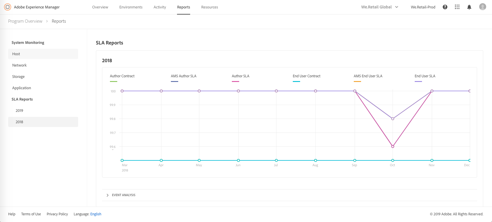

# 시스템 모니터링 {#system-monitoring}

시스템 [!UICONTROL Cloud Manager] 모니터링은 환경 내의 개별 인스턴스를 관찰하고 각 인스턴스에 대한 다양한 지표를 추적하여 수행됩니다. 각 지표에는 *경고 임계값* 및 *위험 임계값입니다*.

지표가 중요한 임계값 위에 있는 경우 중요한 상태로 간주됩니다. 지표가 경고 임계값 (하지만 중요한 임계값 미만) 를 초과하는 경우 경고 상태에 있는 것으로 간주됩니다. 임계값은 Adobe Managed Services에 의해 설정되며 시각화할 수 [!UICONTROL Cloud Manager]있습니다. 대부분의 경우 고객 간의 임계값은 일관되게 유지되지만 Adobe Managed Services는 특정 고객의 요구 사항에 맞게 임계값을 수정할 수 있는 경우가 있습니다. 임계값에 대한 질문은 Customer Success Engineer (CSE) 로 문의하십시오.

## 시스템 모니터링으로 이동 {#navigating-system-monitoring}

시스템 모니터링 기능으로 탐색은 두 가지 방법으로 수행할 수 있습니다.

1. **관리 서비스 - 프로그램** 랜딩 페이지에 로그인합니다.

   

1. 프로그램 카드의 세 번째 아이콘을 클릭합니다.

   

   *또는*,

* 내의 글로벌 탐색 메뉴 항목을 통해 **시스템 모니터링** **랜딩** 페이지로 이동합니다 [!UICONTROL Cloud Manager].

## 시스템 모니터링 개요 페이지 {#system-monitoring-overview-page}

시스템 모니터링 개요 페이지에는 프로그램의 모니터된 환경이 표시되며, 4 개의 별도 카테고리에 걸쳐 높은 수준의 건전성에 대한 보고서가 표시됩니다.

* **호스트**
* **저장 용량**
* **네트워크**
* **애플리케이션**

각 카테고리의 상태는 개별 지표에 대한 요약입니다. 카테고리의 지표가 위험 수준 상태인 경우 전체 카테고리는 개요 페이지의 목적을 위해 위험 수준 상태입니다. 동일한 요약을 환경 수준과 인스턴스 수준에서 볼 수 있습니다.

>[!NOTE]
>
>기본적으로 이 페이지로 이동할 때에는 프로덕션 환경 인스턴스가 표시되지만 다른 환경도 열 수 있습니다.

## 시스템 모니터링 세부 사항 {#system-monitoring-detail}

특정 지표의 세부 사항을 보려면 왼쪽 탐색에서 카테고리 중 하나를 클릭하거나 특정 인스턴스에 대한 카테고리 표시기 중 하나를 클릭하면 됩니다. 각 세부 사항 페이지에는 해당 카테고리 내의 지표에 대한 일련의 그래프가 표시됩니다. 환경 또는 특정 인스턴스에 있는 모든 인스턴스에 대한 지표를 볼 수 있습니다. 오른쪽 위 모서리에 있는 드롭다운 상자를 사용하여 환경과 인스턴스 사이를 전환할 수 있습니다.

왼쪽의 탐색에는 현재 선택된 카테고리 및 인스턴스에 대한 데이터가 있는 현재 선택된 카테고리 내에서 사용 가능한 지표가 표시됩니다.

개별 그래프는 시간 경과에 따른 데이터의 상태와 그래프를 임계값과 함께 보여줍니다. 여러 인스턴스가 표시되는 경우 각 인스턴스의 데이터는 별도의 시리즈에 있게 됩니다.

범례에서 시리즈를 클릭하면 개별 시리즈를 그래프에 숨길 수 있습니다.
예를 들어 경고 임계값 시리즈를 클릭하면 위험 임계값만 표시됩니다.

### 지표 정의 {#metric-definitions}

**호스트**

* 코어당 로드: CPU가 실행하고 있거나 대기 중인 상태 (로드 1), 5 (로드 5) 및 15 분 (로드 15 분) 동안 평균화된 프로세스 수입니다.
* 프로세스 수: 현재 열려 있는 프로세스 수입니다.
* 사용자 카운트: 활성 셸 세션을 사용하는 사용자 수입니다.
* 메모리 사용: 현재 할당된 시스템 메모리의 백분율입니다.
* JVM 메모리 (힙): 할당된 Java 힙 크기 (MB) 입니다.
* 이전 생성 공간: 현재 할당된 JVM 이전 세대의 메모리 비율입니다.

**네트워크**

* CQ 포트 검사: AEM 또는 Dispatcher 포트에 액세스하기 위한 응답 시간 (초) 작성자, 게시 및 Dispatcher 에는 다른 지표가 있습니다.

**저장 용량**

* 디스크 공간: 호스트의 각 마운트 포인트에 대한 사용된 디스크 공간 (MB 단위) 입니다. 각 마운트 포인트에 대한 지표가 다릅니다. 최소한, "/" 및 "/mnt" 에 대한 지표가 표시되지만, 특정 인스턴스 구성에 따라 추가 마운트 포인트 지표가 사용할 수 있습니다.
* 폴더 크기: AEM 세그먼트 스토어: AEM 세그먼트 스토어에 대한 디스크 공간 (GB 단위) 입니다.

**애플리케이션**

* 복제 에이전트: 테스트 복제 이벤트의 시간 (초) 입니다. 각 복제 에이전트에 대한 개별 지표가 있습니다.
* 디스패처 플러시: Dispatcher Flush 대기열에 현재 있는 항목의 수입니다.

## SLA 보고 {#sla-reporting}

고객은 계약 SLA (서비스 수준 계약) 와 관련하여 프로덕션 AEM 환경의 성능을 볼 수 있습니다. 보고서 화면의 하위 메뉴를 통해 사용할 수 있습니다.
예를 들어 아래 그래프는 2018 년 월간 SLA 달성 횟수를 보여줍니다.

시스템 모니터링 그래프와 마찬가지로 데이터 포인트 롤오버에 해당 월의 특정 값이 표시됩니다.

이 그래프 아래의 이벤트 분석 섹션에는 현재 선택한 연도 동안 해당 프로그램에 대해 발생한 일련의 사고가 표시됩니다. 각 사고에는 시간 범위, 원인 및 일련의 주석이 있습니다.

## SLA 지표 {#sla-metrics}

* **작성자 계약서**: 이것은 작성자 계층에 대한 Adobe Managed Services 와의 계약에 정의된 SLA 입니다.

* **AMS Author SLA**: 이는 Adobe 또는 Adobe 공급업자에 의해 야기된 제작 저자의 계층 구조 파괴의 측정입니다.

* **작성자 SLA**: 이것은 유지 관리 창과 같은 예약된 다운타임을 무시하는 작성자 계층의 측정된 시간대입니다.

* **최종 사용자 계약**: 이는 게시 계층에 대한 Adobe Managed Services 와의 계약에 정의된 SLA 입니다.

* **AMS 최종 사용자 SLA**: 이는 Adobe 또는 Adobe 벤더가 일으킨 프로덕션 퍼블리싱 계층의 제작 게시물입니다.

* **최종 사용자 SLA**: 이것은 유지 관리 창과 같은 예약된 작동 중단 시간이 무시되는 게시 계층의 측정된 시간대입니다.