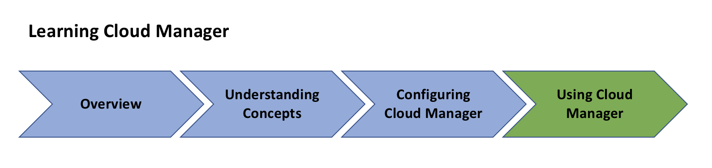

# AEM 개요 [!UICONTROL Cloud Manager]{#overview-index}

[!UICONTROL Cloud Manager] 모든 Adobe Managed Services 고객에게 제공되는 툴 및 기술의 프레임워크입니다.

이 섹션에서는 작업을 시작할 수 있는 리소스 목록에 [!UICONTROL Cloud Manager]대한 높은 수준의 보기를 제공합니다.

주요 개념 및 종결자를 이해하는 것부터 구성 (사전 요구 사항) 를 설정하는 데 이르기까지 사용할 [!UICONTROL Cloud Manager]수 있는 길을 시작하려면 아래 리소스를 따르십시오 [!UICONTROL Cloud Manager].

아래 그림은 귀하의 학습에 대한 로드맵을 보여줍니다 [!UICONTROL Cloud Manager].

개요 섹션의 리소스를 따라 다음을 소개 [!UICONTROL Cloud Manager]:

* **[[! Uicontrol Cloud Manager]](introduction-to-cloud-manager.md)**
* **[주요 개념](key-concepts.md)**
* **[[! Uicontrol 고객 여정](customer-journey.md)**

