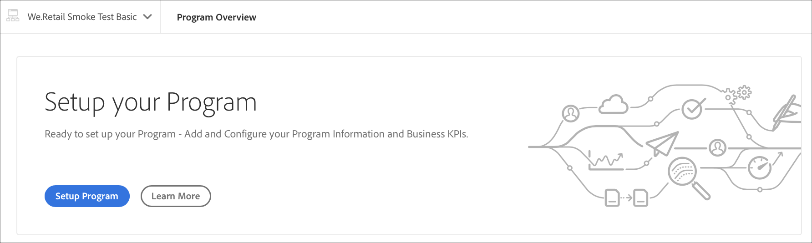
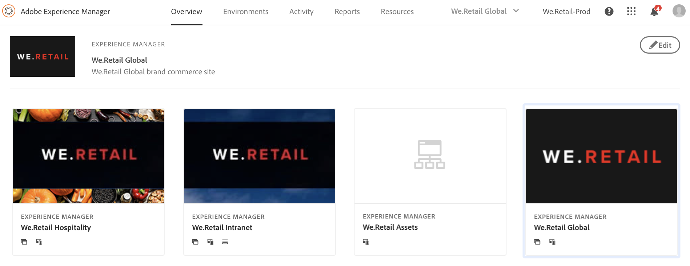

# 프로그램 설정 {#setup-your-program}

입사 후, 사업 소유자는 프로그램의 초기 설정을 완료해야 할 것이다. 여기에는 프로그램 설명을 설정하고 성능 테스트에 사용할 주요 성능 지표(KPI)를 정의하는 작업이 포함됩니다. 축소판을 업로드할 수도 있습니다. 또한 비즈니스 소유자는 프로그램을 설정하는 동안 환경을 프로비저닝할 수 있습니다.

정의된 KPI는 파이프라인을 실행할 때마다 전달되는 성능 테스트의 기준선 역할을 합니다.

>[!NOTE]
>
>정의된 KPI는 **stage** 환경에서 실행되는 테스트에서 측정됩니다. 일반적으로 이러한 KPI는 스테이지 환경의 기능에 맞게 축소됩니다.
>
>예를 들어 사용자는 제작 **Environment**&#x200B;에서 분당 평균 1,000개의 페이지 뷰가 필요하고 제작 과정에서 4개의 디스패처/게시 서버가 이를 분당 250개의 페이지 뷰로 조정해야 합니다(스테이지 환경이 단일 디스패처/게시 서버 쌍으로만 구성된다고 가정).
>
>또한 많은 사용자는 제작 환경 앞에 Akamai 또는 CloudFront와 같은 CDN(Content Delivery Network)을 보유하게 됩니다. 스테이지 환경에 대해 [!UICONTROL Cloud Manager] 테스트를 직접 실시하므로 KPI는 CDN을 통과하는 예상 트래픽만 반영해야 합니다. 즉, 캐시 누락입니다. 일반적으로 전체 프로덕션 트래픽의 비교적 작은 하위 세트가 됩니다.

## [!UICONTROL Cloud Manager]을(를) 사용하여 프로그램 {#using-cloud-manager-to-setup-your-program} 설정

아래 절차에 따라 프로그램을 설정하고 KPI를 정의합니다.

1. **설치 프로그램**&#x200B;을 클릭하여 [!UICONTROL Cloud Manager]에서 설정 프로세스를 시작합니다.

   

   >[!NOTE]
   > 아래 그림과 같이 작업 표시줄에서 언제든지 프로그램을 전환, 편집 또는 추가할 수 있습니다.

   

1. **설치 프로그램** 화면에 프로그램 정보 편집 화면이 표시됩니다.

1. **일반**, **KPI** 및 **프로비저닝** 탭 등 세 가지 옵션이 표시됩니다.

1. **일반** 탭에서 프로그램에 축소판을 업로드합니다. 프로그램에 관련 설명을 추가할 수도 있습니다.

   

1. **KPI**&#x200B;에서 두 개의 KPI를 정의할 수 있습니다(각 배포에 대한 기대). 별도의 KPI는 **AEM Sites** 및 **AEM Assets**&#x200B;에 대해 정의됩니다. 라이선스가 부여된 제품에 대한 KPI를 지정할 수 있습니다.

   **AEM Sites**

   1. 허용되는 95번째 백분위수 응답 시간은 어떻게 됩니까?

      * 권장 값 - 3초
   1. 최대 로드 시 분당 페이지 보기 횟수는 얼마나 됩니까?

      * 권장 값 - 분당 200페이지 보기

   **AEM Assets**

   Cloud Manager는 초기 릴리스 이후 AEM Sites 프로그램에 대한 성능 테스트를 실행할 수 있었습니다. 이번 릴리스에서는 AEM Assets 프로그램에 대한 성능 테스트를 실행하는 기능도 추가되었습니다. 자산 성능 테스트는 30분 테스트 기간 동안 자산을 반복적으로 업로드하고 각 자산에 대한 처리 시간과 다양한 시스템 수준 지표를 측정하여 수행됩니다.
프로그램 설정 중에 자산 관련 KPI가 지정됩니다.

   * 95번째 백분위수 처리 시간
   * 분당 업로드된 자산

   

1. **프로비저닝**&#x200B;에서 프로그램의 프로덕션 및 비프로덕션 환경에 대한 프로비저닝 구성을 보거나 편집할 수 있습니다. 프로그램 자동 맞춤이 켜져 있는 경우 **자동 스케일이**&#x200B;에 표시됩니다.

   >[!NOTE]
   >
   >* 자동 처리 기능은 프로덕션 환경에만 적용되며 일부 고객 프로그램에서는 제공되지 않을 수 있습니다.
   >* 이 [!UICONTROL Cloud Manager] 릴리스에서는 주문형 크기 조정을 사용할 수 없습니다.

   

1. **저장**&#x200B;을 클릭하여 설치 마법사를 완료합니다.

   >[!NOTE]
   >
   >초기 프로그램이 이미 설정된 후에는 항상 프로그램을 편집할 수 있습니다. 자세한 내용은 아래 절차를 따르십시오.

## 프로그램 편집

1. **클라우드 관리자** 홈 화면에서 솔루션으로 이동합니다.

   

1. 솔루션을 선택하고 **편집**&#x200B;을 클릭하여 아래 그림과 같이 프로그램을 업데이트하거나 수정합니다.

   

1. 프로그램을 업데이트하거나 수정할 수 있는 **프로그램 편집** 화면이 표시됩니다.

   

## 다음 단계 {#the-next-steps}

이미 **파이프라인**&#x200B;을 설정한 경우 다음 실행에서는 업데이트된 설정을 고려하게 됩니다. 아직 파이프라인을 설정하지 않은 경우 단계에 따라 먼저 파이프라인을 설정합니다.

파이프라인을 설정하려면 [CI/CD 파이프라인 구성](https://helpx.adobe.com/experience-manager/cloud-manager/using/configuring-pipeline.html)을 참조하십시오.
