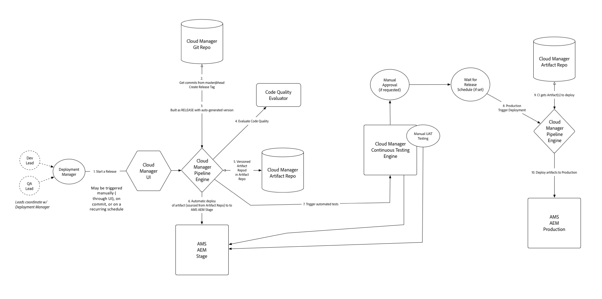

# 클라우드 관리자를 사용하기 전에 개념 이해{#understanding-concepts-before-using-cloud-manager}

이 섹션에서는 클라우드 관리자에서 작업하기 전에 알아야 하는 개념과 끝을 제공하며, 다음 주제를 다룹니다.

* **배포 환경**
* **소스 코드 저장소**
* **보안 및 개인 정보**
* **파이프라인 개요**
* **도움말 리소스**

## 배포 환경 {#deployment-environment}

Adobe Experience Manager (AEM) 6.4를 처음 사용하거나 AEM 6.4 릴리스로 업그레이드해야 할 수도 있습니다.

AEM 6.4를 처음 사용하는 경우 이미 클라우드 관리자에 액세스할 수 있습니다.

기존 고객인 경우 AEM 6.4로 업그레이드해야 클라우드 관리자에 액세스할 수 있습니다. CSE (Customer Success Engineer) 의 URL와 자격 증명을 받으면 클라우드 관리자를 사용할 수 있습니다.

<!-- 

Comment Type: annotation
Last Modified By: ptager
Last Modified Date: 2018-05-02T17:19:24.147-0400

Section is redundant with the section in the Overview topic

 -->

## 소스 코드 저장소 {#source-code-repository}

**여러 Git 서버**: 경우에 따라 고객은 기존 Git 리포지토리를 보유하고 있으며 계속 사용할 수 있습니다.

이러한 경우, Git의 다중 원격 리포지토리에 대한 지원을 사용할 수 있습니다. Git 저장소에서는 일상적인 개발 과정이 계속 진행됩니다. 배포가 필요한 경우 최신 코드를 Cloud Manager Git 리포지토리로 푸시하면 됩니다.

<!-- 

Comment Type: annotation
Last Modified By: ptager
Last Modified Date: 2018-05-02T17:20:46.002-0400

Looks like we lost some content, compared to the previous version

 -->

## 보안 및 개인 정보 {#security-and-privacy}

<!-- 

Comment Type: annotation
Last Modified By: jsyal
Last Modified Date: 2018-04-21T02:38:21.417-0400

Query for Brad B.

 -->

## 파이프라인 개요 {#pipeline-overview}

클라우드 관리자는 스테이지와 프로덕션에 배포할 배포를 처리하는 프로그램 (위의 정의) 당 단일 파이프라인을 지원합니다. ****

단계 및 프로덕션 배포에 사용되는 Git 분기는 Master 입니다.

>[!NOTE]
>
>스테이지와 프로덕션의 Git 분기로 마스터를 사용하는 것이 가장 좋은 방법이지만 파이프라인을 설정하는 동안 분기를 사용할 수 있습니다.

단일 파이프라인 프로세스는 다음과 같습니다.

### 플로우 이해 {#understanding-the-flow}

클라우드 관리자 UI에서 [!UICONTROL Pipeline Settings] 타일을 통해 파이프라인을 구성할 수 있습니다.

자세한 내용은 클라우드 관리자 [사용을](hhttps://helpx.adobe.com/experience-manager/cloud-manager/using/using-cloud-manager.html) 참조하십시오.

배포 관리자는 다음과 같은 파이프라인을 설정할 책임이 있습니다.

* 애플리케이션 분기 지정
* 배포 환경 할당
* 테스트 옵션 정의

이 경우 먼저 Git 리포지토리에서 분기를 선택합니다. 다음으로, 파이프라인을 시작할 트리거를 정의합니다.

그런 다음 프로덕션 배포를 제어하는 매개 변수를 정의할 수 있습니다.

마지막으로 성능 테스트 매개 변수를 구성할 수 있습니다.

>[!NOTE]
>
>파이프라인에 대한 동작 및 환경 설정 구성에 대해 알려면 클라우드 관리자 사용의 [파이프라인 **구성** ] 섹션을 [참조하십시오](using-cloud-manager.md).

### 도움말 리소스 {#help-resources}

Adobe Managed Services 고객 성공 엔지니어에게 지원을 요청하십시오.

### 다음 단계 {#the-next-steps}

이제 클라우드 관리자 개념을 더 잘 이해할 수 있습니다.

프로젝트, 환경 및 팀 (사용자 및 역할) 를 설정하려면 Cloud Manager에 대한 일반 구성 [설정을](setting-configurations-for-cloud-manager.md)참조하십시오.
