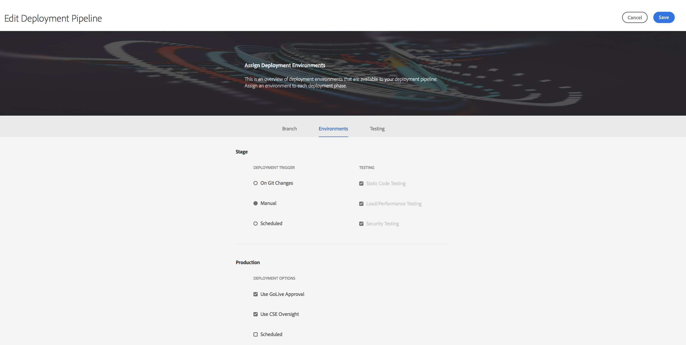

# 클라우드 관리자 사용{#using-cloud-manager}

이 섹션에서는 사용자 인터페이스 (UI) 에 대해 설명하고 [!UICONTROL Cloud Manager] 프로그램 설정에서 코드 배포에 이르는 워크플로우 다음에 품질 검사를 수행하는 방법을 설명합니다.

## 전제 조건 {#prerequisites}

를 사용하기 전에 다음 [!UICONTROL Cloud Manager]섹션을 따르는 것이 좋습니다.

* [[! Uicontrol Cloud Manager]](understanding-concepts.md)
* [[! Uicontrol Cloud Manager]](setting-configurations-for-cloud-manager.md)

## 시작하기 [!UICONTROL Cloud Manager]{#getting-started-with-cloud-manager}

일반 구성을 설정했으면 [!UICONTROL Cloud Manager][!UICONTROL Cloud Manager]을 사용할 수 있습니다.

1. Adobe [!UICONTROL Experience Cloud] 에 로그인하면 솔루션 목록이 표시됩니다.

   

1. 프로그램을 선택하고 왼쪽 상단에 있는 아이콘을 [!UICONTROL Cloud Manager]클릭하여 엽니다.

   

## 프로그램 설정 {#setting-up-program}

입사 후 비즈니스 소유자가 프로그램의 초기 설정을 수행해야 합니다. 여기에는 프로그램 설명을 설정하고 성능 테스트에 사용될 KPI를 정의하는 작업이 포함됩니다. 선택적으로 썸네일을 업로드할 수 있습니다.

정의된 KPI는 파이프라인이 실행될 때마다 전달되는 성능 테스트의 기준선 역할을 합니다.

>[!NOTE]
>
>정의된 KPI는 **스테이지** 환경에서 실행된 테스트에 대해 측정됩니다. 일반적으로 이러한 KPI는 스테이지 환경의 기능에 맞게 축소됩니다.
>
>예를 들어 사용자는 프로덕션 환경에서 분당 평균 1000 페이지 뷰를 기대하고 있으며 프로덕션 시 `dispatcher/publish` 4 개의 서버가 있는 경우 분당 250 개의 페이지 뷰로 크기를 조절해야 합니다 (스테이지 환경이 단일 `dispatcher/publish` 서버 쌍으로 구성되어 있다고 가정할 경우).
>
>또한 많은 사용자는 프로덕션 환경 앞에서 CDN (Akamai, CloudFront) 를 갖게 됩니다. 스테이지 환경에 대한 [!UICONTROL Cloud Manager] 테스트 이후 KPI는 CDN를 통과하는 트래픽, 즉 캐시 실패를 반영해야 합니다. 일반적으로 이는 총 프로덕션 트래픽 중 비교적 적은 하위 세트가 됩니다.

### KPI [!UICONTROL Cloud Manager] 정의 사용 {#using-cloud-manager-to-define-kpis}

프로그램을 설정하고 KPI를 정의하려면 아래 절차를 따르십시오.

1. **설정 프로그램을** 클릭하여 설정 [!UICONTROL Cloud Manager]프로세스를 시작합니다.
1. [프로그램 정보 **편집** ] 화면이 표시됩니다.

   썸네일을 프로그램에 업로드합니다. 프로그램에 관련 설명을 추가하고 **[다음**] 를 클릭할 수도 있습니다.

1. 사용자 **구성** 화면이 표시됩니다.

   팀 역할 및 사용자를 구성할 수 있습니다. **다음**을 클릭합니다.

1. 일반 비즈니스 KPI **구성** 화면이 표시됩니다.

   두 KPI를 정의할 수 있습니다 (각 배포에 대한 기대치).

   1. 귀하에게 허용되는 95 번째 백분위수 응답 시간은 언제입니까?

      1. 권장 값 - 3 초
   1. 피크 로드 아래 분당 페이지 뷰 수는 몇 개입니까?

      1. 권장 값 - 200 pv/m


1. **제출을** 클릭하여 설정 마법사를 완료합니다.

   배포 [!UICONTROL Cloud Manager] 변경에 대한 홈 화면이 **표시됩니다**.

## 사용 가능한 환경 {#available-environments}

In the **available environment** in the [!UICONTROL Cloud Manager] lists all managed AEM environment.

나열된 각 환경에는 이와 연관된 상태가 있습니다.

## 파이프라인 구성 {#configuring-pipeline}

### 파이프라인 설정 {#setting-up-pipeline}

>[!CAUTION]
>
>Git 리포지토리에 하나 이상의 브랜치가 있어야 파이프라인을 설정할 수 있습니다.

코드를 배포하기 전에에서 파이프라인 설정을 구성해야 [!UICONTROL Cloud Manager]합니다.

파이프라인 구성에 **대한** [자세한 내용은Uicontrol Cloud Manager]](understanding-concepts.md)**.

>[!NOTE]
>
>초기 설정 후 파이프라인 설정을 변경할 수 있습니다.

### Configuring pipeline settings from the [!UICONTROL Cloud Manager]{#configuring-pipeline-settings-from-the-cloud-manager}

파이프라인에 대한 Bahavior 및 기본 설정을 구성하려면 아래의 [!UICONTROL Cloud Manager] 절차를 따르십시오.

1. **분기** 탭에 액세스하여 애플리케이션 분기를 설정합니다.

   설정할 Git 분기를 선택합니다.

   >[!NOTE]
   >
   >Git 리포지토리에서 발견된 분기는 프로그램에 연결됩니다.

   

1. **환경** 탭에 액세스하여 **단계** 및 **프로덕션** 옵션을 선택합니다.

   파이프라인을 시작할 트리거를 정의할 수 있습니다.

   * **수동** - 사용자가 파이프라인을 시작하려면 UI에서 수동으로 클릭해야 합니다.
   이제 프로덕션 배포를 제어하는 매개 변수를 정의합니다. 사용 가능한 세 가지 옵션은 다음과 같습니다.

   * **Go Live 승인 사용**- [!UICONTROL Cloud Manager] UI를 통해 비즈니스 소유자, 프로젝트 관리자 또는 배포 관리자가 배포를 수동으로 승인해야 합니다.
   * **CSE 관리자 사용** - 실제로 배포를 시작하려면 CSE가 참여합니다.
   

1. **테스트** 탭을 이용하여 프로그램에 대한 테스트 기준을 정의합니다.

   이제 성능 테스트 매개 변수를 구성할 수 있습니다.

   

## 코드 배포 {#deploying-code}

파이프라인 (저장소, 환경 및 테스트 환경) 를 구성했으면 코드를 배포할 준비가 되었습니다.

### 코드 배포 [!UICONTROL Cloud Manager]{#deploying-code-from-cloud-manager}

아래 절차에 따라 코드를 프로덕션 환경에 배포합니다.

1. 에서 **배포를** 클릭하여 [!UICONTROL Cloud Manager] 배포 프로세스를 시작합니다.
1. **스테이지 배포** 화면이 표시됩니다.

   **빌드를** 클릭하여 프로세스를 시작합니다.

1. 전체 빌드 프로세스에서는 코드를 확인하고 배포하기 위한 몇 가지 매개 변수를 고려합니다.

   다음 매개 변수는 다음과 같습니다.

   **스테이지 배포**

   * 보관소
   * 유닛 테스트
   * 코드 스캔
   * 스테이지 환경에 배포
   **프리 프로덕션 테스트**

   * 보안 테스트
   * 성능 테스트
   >[!NOTE]
   >
   >또한 위에서 언급한 테스트 기준에 대한 로그를 보거나 결과를 검토할 수도 있습니다.

## 품질 확인 결과 {#results-from-quality-checks}

파이프라인에 세 개의 게이트가 있습니다. 코드 품질, 성능 테스트 및 보안 테스트

이러한 각 게이트에는 게이트가 식별한 문제에 대한 세 가지 계층 구조가 있습니다.

* **중요** - 게이트가 바로 파이프라인의 실패를 초래하는 문제입니다.
* **중요** - 게이트가 일시 중지 상태를 입력하는 원인이 되는 문제입니다. 배포 관리자, 프로젝트 관리자 또는 비즈니스 소유자는 문제를 무시하거나, 파이프라인이 실패하거나, 문제가 있는 경우 파이프라인이 실패하는 문제를 해결할 수 있습니다.
* **정보** - 이러한 문제는 게이트에 의해 식별된 문제이며, 단지 정보용으로만 제공되지만 파이프라인 실행에 영향을 주지 않습니다.

### 코드 스캔 {#code-scanning}


### 성능 테스트 {#performance-testing}

*성능 테스트는* 30 분 [!UICONTROL Cloud Manager] 동안 테스트를 사용하여 구현됩니다.

파이프라인 설정 중에 배포 관리자는 각 버킷으로 이동할 트래픽의 양을 결정할 수 있습니다. 모든 세 개의 버킷에서 모두 원하는 부분을 선택할 수 있습니다. 트래픽 분배는 선택한 버킷 수를 기반으로 합니다. 예를 들어 세 개의 모두 선택되어 있는 경우 총 페이지 보기의 33%가 각 버킷에 추가됩니다. 둘을 선택하면 50%가 각 세트로 갑니다. 하나만 선택하면 트래픽의 100%가 해당 세트로 이동합니다.

예를 들어 인기 있는 라이브 페이지와 새 페이지 세트 간에 50%/50% 분할이 있고 (이 예에서는 다른 라이브 페이지가 사용되지 않음) 새 페이지 세트에 3000 페이지가 포함되었다고 가정합니다. 분당 페이지 보기 수 KPI는 200로 설정됩니다. 30 분 테스트 기간 동안:

* 인기 있는 라이브 페이지 세트의 25 페이지 각각이 240 번 히트 처리됩니다. `((200 &#42; 0.5) / 25) &#42; 30 = 120`
* 새 페이지 세트의 3000 페이지가 각각 히트 수가 됩니다. `((200 &#42; 0.5) / 3000) &#42; 30 = 1`


### 성능 테스트 지표 {#performance-test-metrics}

테스트 기간 동안 많은 지표가 캡처되고, 비즈니스 소유자가 정의한 KPI 또는 AMS가 설정한 기준에 비해 많은 지표가 캡처됩니다.

다음과 같이 3 계층 게이팅 시스템을 사용하여 보고됩니다.

### 파이프라인을 실행하는 동안 세 개의 계층 구조 {#three-tier-gates-while-running-a-pipeline}

파이프라인에 코드 품질, 성능 테스트 및 보안 테스트라는 세 개의 게이트가 있습니다.

이러한 각 게이트에는 게이트가 식별한 문제에 대한 세 가지 계층 구조가 있습니다.

* **중요**: 이는 게이트가 바로 파이프라인을 실패하는 원인이 되는 문제입니다.
* **중요**: 이러한 문제는 게이트가 일시 중지 상태를 입력하는 원인이 되는 게이트 문제입니다. 배포 관리자, 프로젝트 관리자 또는 비즈니스 소유자는 문제를 무시하거나, 파이프라인이 실패하거나, 문제가 있는 경우 파이프라인이 실패하는 문제를 해결할 수 있습니다.
* **정보**: 이러한 문제는 게이트에 의해 식별된 문제이며, 단지 정보용으로만 제공되지만 파이프라인 실행에 영향을 주지 않습니다.

다음 표에는 세 가지 계층 구조의 게이팅 시스템을 사용한 성능 테스트 행렬이 요약되어 있습니다.

| **지표** | **카테고리** | **실패 임계값** |
|---|---|---|
| 페이지 요청 오류율 % | 중요 사항 | &gt;= 2% |
| CPU 사용률 | 중요 사항 | &gt;= 80% |
| 디스크 IO 대기 시간 | 중요 사항 | &gt;= 50% |
| 95 개의 백분위수 응답 시간 | 중요 사항 | &gt;= 프로그램 수준 KPI |
| 최대 응답 시간 | 중요 사항 | &gt;= 18 초 |
| 분당 페이지 보기 횟수 | 중요 사항 | &lt; 프로그램 수준 KPI |
| 디스크 대역폭 활용 | 중요 사항 | &gt;= 90% |
| 네트워크 대역폭 활용 | 중요 사항 | &gt;= 90% |
| 분당 요청 수 | 정보 | &lt; 6000 |

### 보안 테스트 {#security-testing}

[!UICONTROL Cloud Manager] 배포 이후 스테이지에서 기존 *AEM 보안 히스 검사를* 실행하고 UI를 통해 상태를 보고합니다. 결과는 환경의 모든 AEM 인스턴스에서 집계됩니다.

인스턴스 중 하나라도 해당 Health Check에 실패하는 경우 전체 환경에 Health Check가 실패합니다. 코드 품질 및 성능 테스트와 마찬가지로 이러한 상태 확인은 카테고리로 구성되며 3 계층 게이팅 시스템을 사용하여 보고됩니다. 유일한 차이점은 보안 테스트의 경우 임계값이 없다는 것입니다. 모든 상태 검사는 단순히 합격 또는 불합격입니다.

현재 검사는 다음과 같습니다.

| **Health Check** | **카테고리** |
|---|---|
| Deserialization Firewall Attach API Readiness | 중요 사항 |
| Deserialization Firewall Functional | 중요 사항 |
| Deserialization Firewall Loaded | 중요 사항 |
| 승인 가능한 노드 이름 생성 | 중요 사항 |
| 기본 로그인 계정 | 중요 사항 |
| Sling Get Servlet | 중요 사항 |
| CQ Dispatcher 구성 | 중요 사항 |
| CQ HTML 라이브러리 관리자 구성 | 중요 사항 |
| Sling Java Script Handler | 중요 사항 |
| Sling Jsp Script Handler | 중요 사항 |
| Sling Referrer Filter | 중요 사항 |
| SSL 구성 | 중요 사항 |
| 사용자 프로필 기본 액세스 | 중요 사항 |
| CRXDE 지원 | 중요 사항 |
| DavEx 상태 검사 | 중요 사항 |
| 컨텐츠 패키지 예 | 중요 사항 |
| WCM 필터 구성 | 중요 사항 |
| WebDAV 상태 검사 | 중요 사항 |
| 웹 서버 구성 | 중요 사항 |
| 복제 및 전송 사용자 | 정보 |

### Sonarqube의 품질 확인 구현 {#quality-check-implementation-by-sonarqube}

파이프라인의 일부로서, 위에 설명된 대로 코드가 스캔됩니다. 현재 이 구현은 Sonarqube에서 구현합니다. Adobe 에는 일반 Java 규칙과 AEM 관련 규칙의 조합인 93 개의 규칙이 있습니다 (Cognifide의 기존 규칙 세트에서 일부 포함). 이러한 규칙의 목록은 다음과 같습니다. [Sonarqube 규칙](assets/sonarqube-rules.xlsx)

이러한 규칙에서 다양한 지표가 계산되며, 이 중 일부는 스테이지 환경에 배포하기 전에 품질 게이트로 사용됩니다.

다음은 현재 임계값입니다.

| 이름 | 정의 | 카테고리 | 실패 임계값 |
|--- |--- |--- |--- |
| 보안 등급 | a = 0 취약성 <br/>B = 최소 1 개의 사소한 취약점<br/> C = 최소 1 개의 주요 취약점 <br/>D = 최소 1 개의 치명적인 취약점 <br/>E = 최소 1 개의 차단기 취약점 | 중요 사항 | &lt; B |
| 안정성 등급 | a = 0 버그 <br/>b = 최소 1 개의 사소한 버그 <br/>c = 최소 1 개의 주요 버그 <br/>d = 최소 1 개의 중요한 버그 e = 최소 1 개의 차단기 버그 | 중요 사항 | &lt; C |
| 유지 관리 용이성 등급 | 코드 스니트에 대한 탁월한 교정 비용은 다음과 같습니다. <br/><ul><li>&lt; = 이미 애플리케이션에 있었던 시간의 5% 입니다. 등급은 </li><li>6 ~ 10%의 등급은 A 입니다. </li><li>11 ~ 20% 등급은 C 입니다. </li><li>21 ~ 50%의 등급은 D 입니다.</li><li>50% 이상이 e</li></ul> | 중요 사항 | &lt; A |
| 범위 | 이 공식을 사용한 라인 커버리지 및 조건 범위의 혼합: <br/>`Coverage = (CT + CF + LC)/(2*B + EL)`<br/>위치: ct = 최소 한 <br/>번 <br/>LC = covered lines = lines_ to_ cover - discovered_ lines <br/><br/> b = total number of executable el = total number <br/>of executable lines (lines_ to_ cover) 에서 적어도 한 번 평가된&#39;true&#39;로 평가된 조건 | 중요 사항 | &lt; 50% |
| 건너뛴 유닛 테스트 | 건너뛴 단위 테스트 수입니다. | 정보 | &gt; 1 |
| 문제 해결 | 전반적인 문제 유형 - 취약점, 버그 및 코드 냄새 | 정보 | &gt; 1 |
| 중복 라인 | 복제된 블록과 관련된 라인 수입니다. <br/>코드 블록을 복제한 것으로 간주할 수 있습니다. <ul><li> **비 Java 프로젝트:**</li><li>연속된 토큰은 100 개 이상 있어야 합니다.</li><li>이러한 토큰은 적어도 다음에서 확산되어야 합니다. </li><li>Cobol 용 30 줄의 코드 </li><li>ABAP 용 코드 줄 20 개 </li><li>다른 언어용 코드 줄 10 개</li></ul><ul><li>**Java 프로젝트:**</li><li> 토큰 수와 줄 수에 관계없이 연속된 10 개 이상의 중복된 문이 있어야 합니다.</li></ul>중복을 탐지하는 동안에는 들여쓰기 및 문자열 리터럴의 차이점이 무시됩니다. | 정보 | &gt; 1% |

### 거짓 양 {#false-positives}

품질 스캔 프로세스는 완벽하지 않으며 간혹 문제가 되지 않는 문제를 잘못 식별하기도 합니다. 이것을 *거짓 긍정 (**false 네거티브가* 더 의미적으로 올바름) 이라고 합니다. 이러한 경우 소스 코드에 규칙 ID를 주석 특성으로 지정하는 표준 Java `@SuppressWarnings` 주석을 사용하여 주석을 달 수 있습니다. 예를 들어, 하드 코딩된 암호를 감지하는 Sonarqube 규칙은 하드 코딩된 암호로 간주되는 내용에 대해 매우 자유롭다는 것입니다.

특정 예제를 살펴보기 위해 이 코드는 일부 외부 서비스에 연결하기 위한 코드가 있는 AEM 프로젝트에서 매우 일반적입니다.

```java
@Property(label = "Service Password")
private static final String SERVICE_PASSWORD = "password";
```

Sonarqube는 이것을 차단기 취약점으로 끌어올립니다. 이 경우 고객은 이 취약점이 취약하지 않음을 식별하고 적절한 규칙 ID로 주석을 달 수 있습니다.

```java
@SuppressWarnings("squid:S2068")
@Property(label = "Service Password")
private static final String SERVICE_PASSWORD = "password";
```

그러나 실제로는 코드가 다음과 같은 경우입니다.

```java
@Property(label = "Service Password", value = "mysecretpassword")
private static final String SERVICE_PASSWORD = "password";
```

고객은 Sonarqube의 경고를 심화하고 하드 코딩된 암호를 제거해야 합니다. 하지만 Sonarqube 규칙이 실제로 약어로 트리거되므로 `@SuppressWarnings` 주석을 추가해야 `password`합니다.

>[!NOTE]
>
>`@SuppressWarnings` 주석을 가능한 한 구체적으로 만드는 것이 가장 좋은 방법입니다. 즉, 문제의 원인이 되는 특정 문이나 블록에만 주석을 달 수 있으며 클래스 수준에서 주석을 달 수 있습니다.

